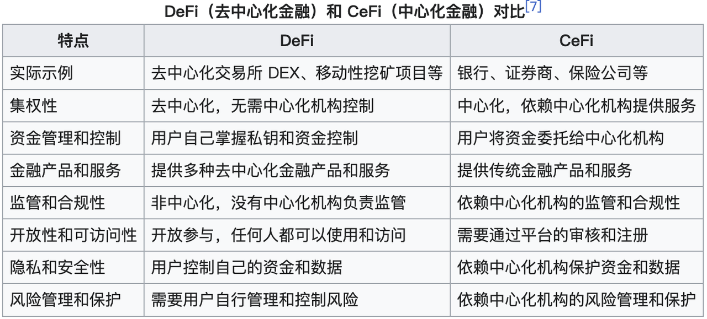
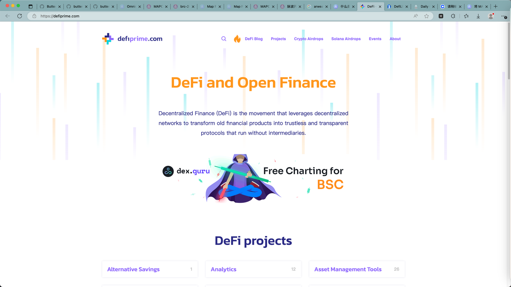
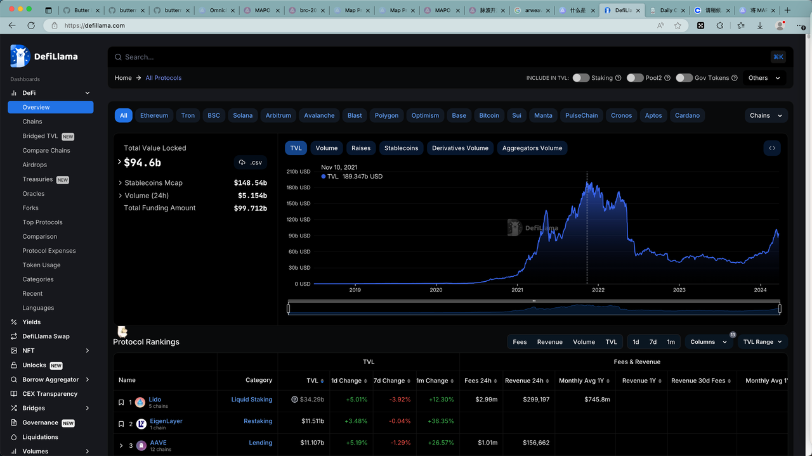
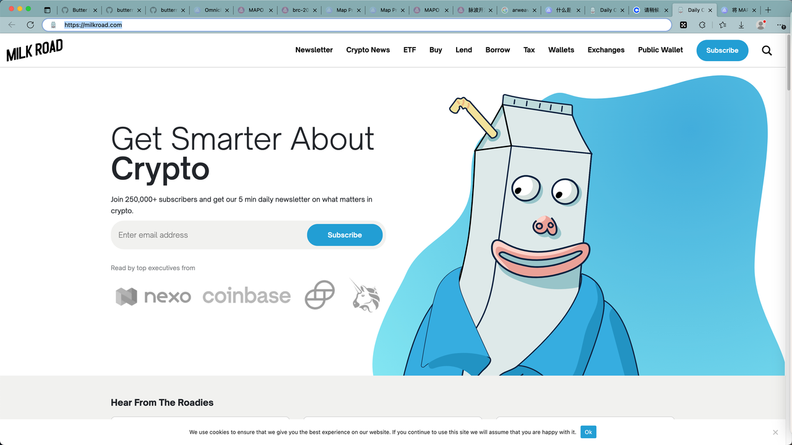

# DeFi
* DeFi=Decentralized Finance=去中心化金融 
  * DeFi一词创造时间：2018年 
    * DeFi 始于以太坊区块链 
  * 是什么 
    * 一种建立于区块链上的金融 
  * 概述 
    * 在区块链上构建的数字资产、金融类智能合约、协议和DApp 
    * 利用区块链上的智能合约（例如以太坊）进行金融活动 
    * 不依赖券商、交易所或银行等金融机构提供的金融工具 
      * 在没有像银行这样的中央集权机构的情况下可用的金融产品和服务 
  * 目标 
    * 旨在让每个人都更便宜、更便捷、更容易获得金融服务 
    * 一个开放的、无需许可的、无需信任的金融产品世界 
  * 优势 
    * 去中心化：DeFi平台的运营不需要中心化机构的参与，使用区块链技术与智能合约自动完成交易流程。 
    * 系统透明：任何人都可以阅览构建平台的代码，交易活动在分布式账本上可见。 
      * 审计、税收和遵守法律 
        * 开放式账本技术允许任何人来验证交易，通过透明化和自动化减少了欺诈，而使用传统的孤立私有系统很难或不可能做到这一点。还有其他技术正被创造，允许进行这种验证，同时保持隐私不受侵犯。 
    * 可互操作：所有协议都是开源的，可以满足用户组合DeFi应用，构建新的金融产品的需要。 
    * 无需许可：任何人都有访问权限，无需经过中央机构的认证。无论用户身处何处，都可以拥有相同的DeFi服务。 
    * 其他 
      * 能源（消耗） 
        * 尽管运行区块链网络要使用大量电力，但它所使用的能量仍然远低于实体货币、银行分行、武装押运、电汇以及世界上其他的银行系统。随着 Ethereum 现在使用权益证明，该网络所使用的能量比 Netflix 少了近万倍 
  * 特点 
    *  信任最小化 
      * 它依赖于区块链技术，而不是像经纪人或银行维护的集中式数据库，这意味着用户不必盲目地相信规则不透明的大机构 
    * 无需许可 
      * 任何拥有加密钱包的人都可以参与，无需财务资格或政府等权威机构的批准 
  * 依赖于：智能合约 
    * 对比：传统金融 依赖于 （金融）中介（机构） 
  * 举例 
    * 比特币，可以认为，是 DeFi 世界的一小部分 
  * 实现途径 
    * 钱包 = 一个自我托管的加密钱包 
      * 举例 
        * Brave 钱包 
          * https://brave.com/zh/wallet/
  * 发展 
    * 截至2020年10月，超过110亿美元被存入各种去中心化金融协议 
    * 截至2021年 8月底，已经有超过1500亿存入各种去中心化金融协议 
  * 对比 
    * DeFi（去中心化金融）和 CeFi（中心化金融）对比 
      * 
    * DeFi 与传统金融的对比 
      * 中心化 vs. 去中心化 
        * 传统金融：操作依赖于中心化金融机构 
        * DeFi：运行在区块链上，依靠智能合约自动执行，消除了对传统中介或中心化机构的需求 
      * 交易速度和成本 
        * 传统金融：交易处理时间漫长，尤其是跨境交易，通常伴有高额交易费用 
        * DeFi：交易几乎是即时的，更具成本效益 
      * 可访问性和包容性 
        * 传统金融：通常要求身份验证，可能受地理和经济背景的限制 
        * DeFi：理论上为全球任何拥有互联网接入的用户提供服务，无需传统银行系统所需的身份验证 
      * 安全性和风险 
        * 传统金融：受到既定的监管和保险机制的保护，但也易受系统性风险的影响 
        * DeFi：虽然减少了中介风险，但面临智能合约漏洞、操作错误和监管不确定性的风险 
  * 举例 
    * 像 Chase 或 PayPal 这样的公司，它们可以帮助您交易货币、获得贷款或在世界任何地方发送付款。在所有情况下，您都依赖于银行或经纪人——一些中央集权机构——来提供这些服务。 DeFi 就是通过自动化智能合约，以可公开验证的透明度协调相同（和更好）的金融服务……但仅限于同行之间 
  * 详解 
    * 它使用公共区块链网络进行交易，无需依赖托管机构、中央票据交换所或托管代理等中心化的服务提供商。相反，这些角色由所谓的“智能合约”承担 
    * 智能合约是计算机代码形式的指令。该代码存储在公共区块链上，并作为系统共识规则的一部分被执行。去中心化金融的协议在设计上可以禁止干预和操纵。在所有参与者参与并验证一切得到妥善执行前，他们都可遵守这些规则。状态的改变（如账户余额的更新）会被反映在区块链上，任何人都可以验证 
    * 在去中心化金融的背景下，智能合约主要用于确保两种资产的“原子性”转让（即这种转让同时发生，不可分割），或是在托管账户中持有抵押品。在这两种情况下，资产都受智能合约规则的约束。只有在满足预定义的条件时，才予以放行。 
    * 通过利用这些特性，去中心化金融可以降低交易对手风险并复刻出众多的金融服务，且无需中介机构和中心化平台运营商参与其中。这可降低成本和出错的概率。借贷市场、交易协议、金融衍生品、资产管理协议只是众多例子中的一小部分 
  * 如何工作=工作原理 
    * DeFi 通过区块链上的智能合约运作，自动执行各种金融交易和协议，从而消除了对传统金融中介的需求。用户通过加密货币钱包与 DeFi 生态系统互动，参与借贷、交易、投资等金融活动。DeFi 还涉及资产的代币化（如稳定币），允许使用加密货币作为交易媒介。 
    * 此外，许多 DeFi 平台使用自动化做市商（AMM）模型来促进交易，并通过链上治理使代币持有者能够参与项目决策。 
  * DeFi 数据 
    * DeFi Prime 
      * https://defiprime.com/
        * 
    * DeFi Llama 
      * https://defillama.com/
        * 
    * DeFi Rate 
      * https://defirate.com/
        * == https://milkroad.com
          * 
