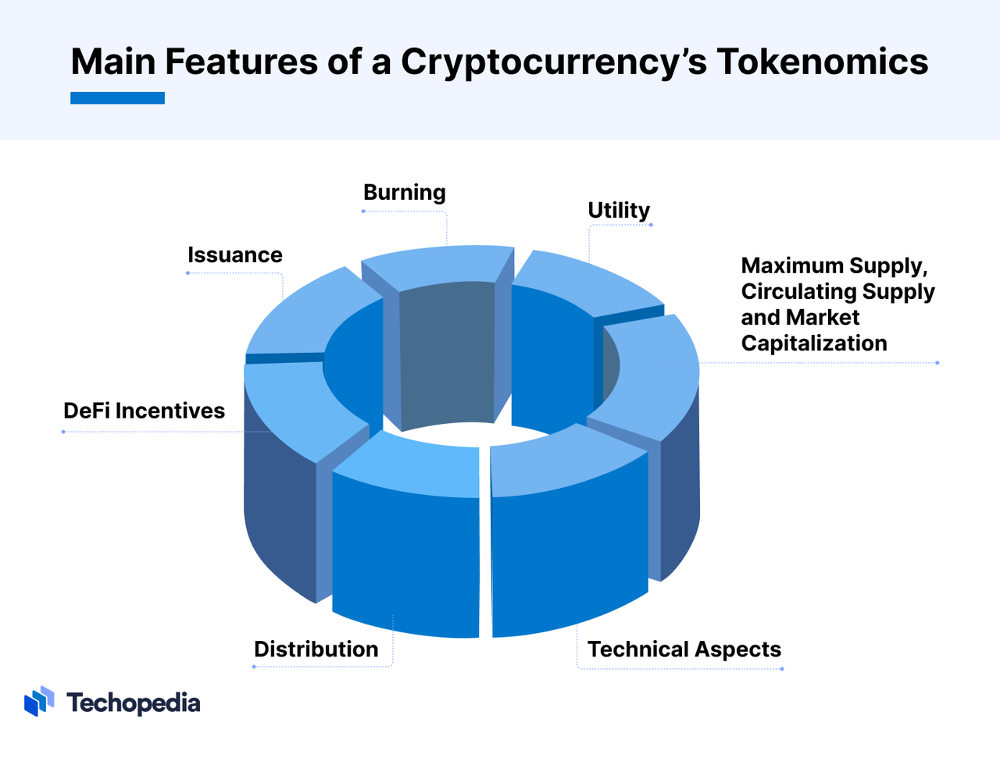

# Tokenomics代币经济学

* 代币经济学=Tokenomics 
  * = Token + Economics 
    * = 代币 + 经济学 
    * = 加密货币 + 经济学 
  * 含义：负责规划和实施用户对数字资产的开发、分配和消费 
    * 描述了影响代币用途和价值的因素，包括但不限于代币的创造和分配，供应和需求，激励机制和代币销毁时间表 
  * 研究内容：代币的经济运作模式 
  * 评价 
    * 在加密领域很重要 
      * 对于加密货币项目来说，完善的代币经济模型是成功的关键 
  * 影响代币经济学的主要变量 
    * 挖矿和质押 
      * 对于以太坊 1.0 和比特币等基础层区块链，挖矿是去中心化计算机网络验证交易的核心激励因素。在这里，新的代币被提供给那些将计算能力用于发现新区块、用数据填充它们并将它们添加到区块链中的人。质押奖励那些扮演类似角色的人，但通过将许多硬币锁定在智能合约中——这就是像 Tezos 这样的区块链的运作方式，也是以太坊在其 2.0 升级中走向的模式 
    * 收益率 
      * 去中心化金融平台提供高收益，以激励人们购买和质押代币。代币被质押在流动性池中——巨大的加密货币池，为去中心化交易所和借贷平台等提供动力。这些收益以新代币的形式支付 
    * 代币销毁 
      * 一些区块链或协议“销毁”代币 – 将它们永久从流通中移除 – 以减少流通中的代币供应。根据供求规律，减少代币的供应应该有助于支撑其价格，因为流通中的剩余代币变得更加稀缺。2021 年 8 月，以太坊开始销毁作为交易费用发送的部分代币，而不是发送给矿工 
    * 有限与无限供应 
      * 代币经济学决定了代币的最大供应量。例如，比特币的代币经济学规定，最多可以开采2100万枚硬币，最后一枚硬币预计将在2140年左右进入流通。相比之下，以太坊没有上限，尽管它每年的发行量是有上限的。NFT（非同质化代币）项目将稀缺性发挥到极致;有些收藏品可能只为一件艺术品铸造一个 NFT 
    * 代币分配和归属期 
      * 一些加密项目考虑了代币的详细分配。通常，一定数量的代币是为风险投资家或开发商保留的，但问题是他们只能在一定时间后出售这些代币。随着时间的推移，这自然会对硬币的流通供应产生影响。理想情况下，项目团队将实施一个系统，其中代币的分配方式尽可能减少对流通供应和代币价格的影响 
  * 核心组成 
    * 概述图 
      * 
    * Total Supply=总发行量 
      * 分类 
        * 有限供应 
          * BTC 
            * 2100 万个 
        * 无限供应 
          * ETH 
            * 2014年ICO得到：6000万个 
            * 之后：每年发行上限：1800万 
            * 目的：保持通胀率相对稳定，并鼓励持续的创新和参与 
    * Token Distribution = 代币的分布 = 代币的分配 
      * 详见：代币的分配
    * Token Emission = 代币的释放 
      * 详见：代币的释放
    * Revenue Sharing=Profit Sharing=收益分成 
      * 含义 
        * 项目会将收入的一部分给代币持有者作为奖励 
      * 评价 
        * 代币持有者最直接的收入来源 
      * 方式 
        * Buyback &Burn 
          * 含义：用收益在市场中购买代币，将代币进行烧毁以减少代币流通总量 
          * 效果：理论上这对币价提升有正面影响 
          * 举例： 
            * MakerDAO 
          * 优点：非常容易执行 
          * 评价：现在大部分已不被采用 
        * Staking 结合 Profit Sharing 
          * 含义：请代币持有者将代币质押，再将收益换成代币分给质押者 （Staker） 
          * 评价：目前大部分项目采用此方式 
          * 优点： 
            * 可以将收益集中给特定代币持有者 
              * 而不是奖励所有持有者 
                * 背景：其中很多可能是消极的持有，对项目没什么贡献 
            * 对项目来说，等于用项目定期买入代币，对币价也有正面影响 
            * 对 Staker 优点是可以感受到实质的奖励 
        * veModel 
          * 含义：Staker 可以决定要 Stake 的多久（例如一年）时间长短会影响到获得的收益分成 
          * 目的：让长期的代币持有者可以获得更高的奖励 
          * 评价：基于第二种的进化版 
          * 影响和效果 
            * Stake 越久会收益越高 
            * 另外也影响 Voting Power 和 LM(Liquidity Mining)奖励 
          * 举例 
            * Curve 
      * 核心逻辑 
        * 应该：以最大化长期代币持有者为主 
        * 不应该：不顾市场情况下定期 buyback代币并分成 
    * Voting Power=投票权 
      * 含义：代币具有投票权 
      * 详细逻辑 
        * 通常代币数量就等于 Voting Power 
        * 后来有项目提出将代币进行 Staking，才能进行投票 
          * 这个机制可以确保投票的人是对项目有信心的长期持有者，并降低市场流通量对价格有正面影响 
        * 再进阶的做法是根据代币持有者 Staking 的时间长短，来决定其拥有的 Voting Power 
      * 特殊例子 
        * veModel 
          * 将分配Liquidity Mining奖励的权力完全交给代币持有者，这除了解决如何有效分配奖励的问题，也提升了代币的价值，使得想要获得更多奖励的项目会收购代币或贿赂代币持有者 
    * Community Incentive=社区激励？=社区奖励？ 
      * 含义：把代币作为奖励，奖励给相关的人 
      * 背后逻辑：项目为了要让代币去中心化，所以需要把大部分代币（超过 50%）发给社群也就是除了团队和相关人员之外的人，这样才能成为是一个完全去中心化的项目 
      * 评价：和传统 Shares 差异最大 
      * 对比 
        * 传统公司：非常少有的，把股权分送给用户，甚至拿来办活动的情况，顶多尾牙抽奖犒赏员工 
        * Crypto世界：项目将代币作为奖励或营销工具是非常常见的 
      * 常见奖励对象 
        * 用户 
        * 贡献者 
        * 社群成员 
        * Staker 
      * 奖励分发方式 
        * 空投=Airdrop 
        * Liquidity Mining =流动性挖矿 
        * Grant=奖金 
