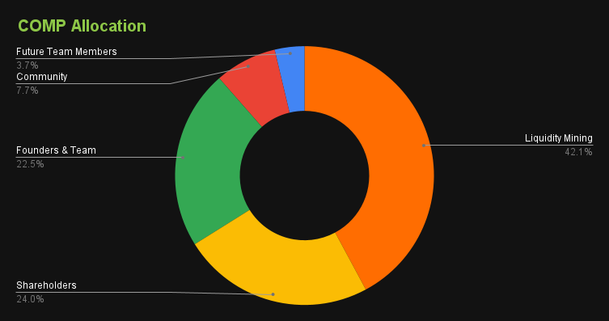
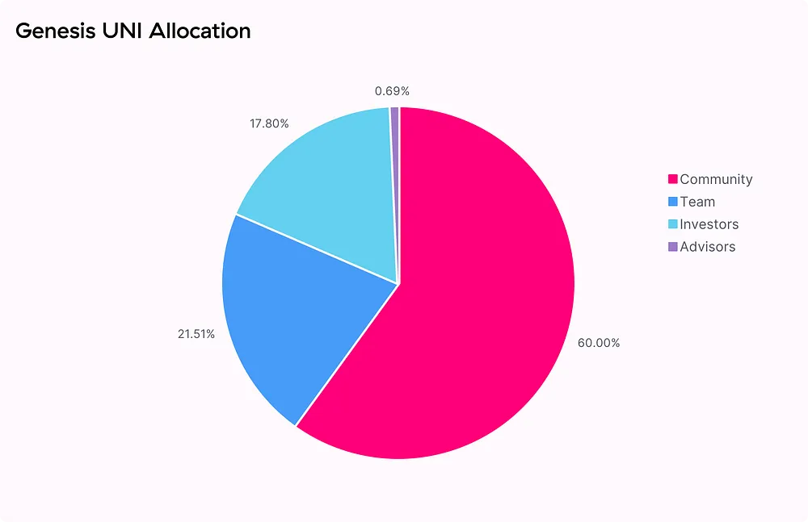
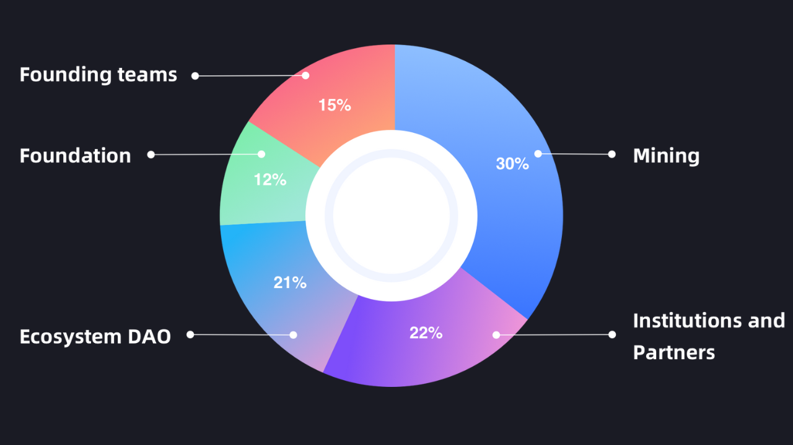
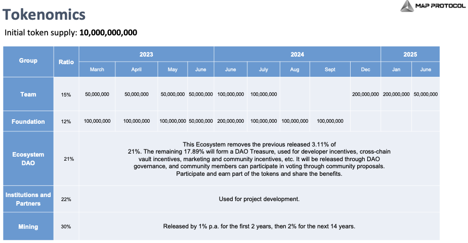
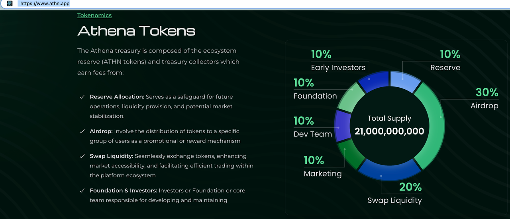
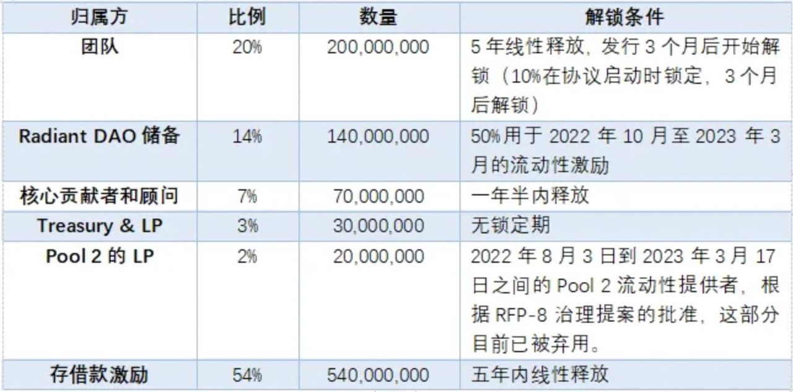

# 代币的分配

* 代币的分配=  Token Allocation 
  * Compound的COMP 
    * 
    * 说明 
      * 42.15% is allocated to Liquidity Mining 
      * 23.95% is allocated to Shareholders 
      * 22.46% is allocated to Founders & Team 
      * 7.73% is allocated to the Community 
      * 3.71% is allocated to Future Team Members 
  * AAVE的AAVE 
    * TODO： 
  * UNI Token 
    * 
  * MAP Protocol的MAPO/MAP 
    * 概述 
      * 
    * 详解 
      * 图 
        * 
        * 
      * 说明 
        * 15% are for developers of MAP Protocol, with a vesting period of 2019 to 2025. 
        * 21% are for Ecosystem DAO, not locked, and fully decided by the MAPO Community on how the token should be used. For MAPDAO governance, all major decisions that may impact community members need to be fully discussed on the MAP forum and subsequently be voted on-chain. 
        * 12% are for MAP Foundation for building the initial state of the MAP Protocol ecosystem and the web3 omnichain ecosystem before it becomes fully decentralized. 
        * 22% are for its investors and early supporters. 
        * 30% are mining rewards for validators on MAP Protocol Network, and Maintainers. 
    * Athena的AHTN 
      * 
  * LayerZero的RDNT 
    * 发行总量：10 亿 
    * 流通量：3 亿 
    * 主要作用：治理和流动性激励 
    * 发行和释放 
      * 
