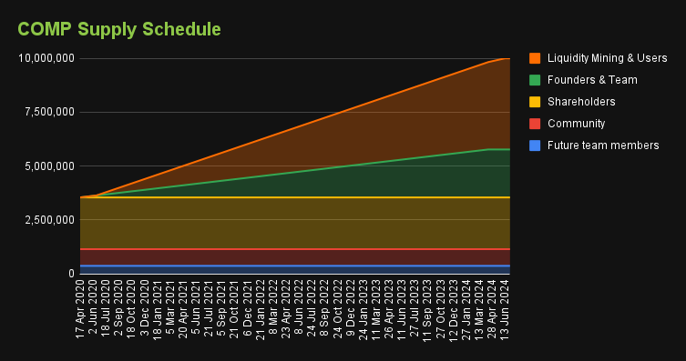
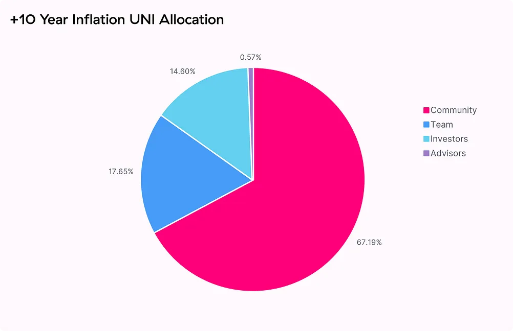
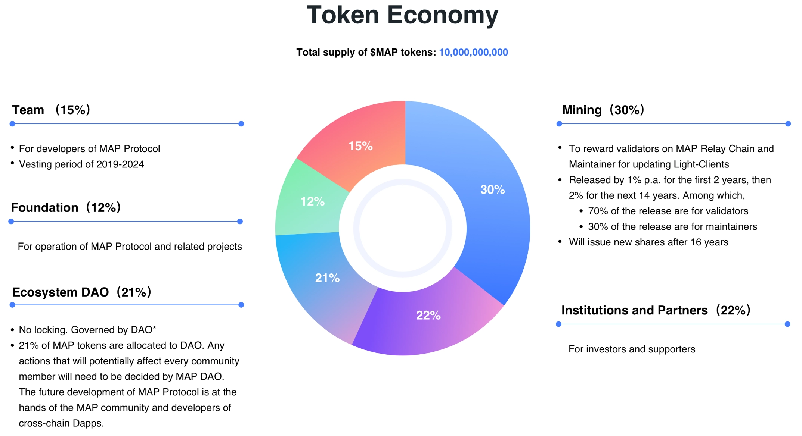
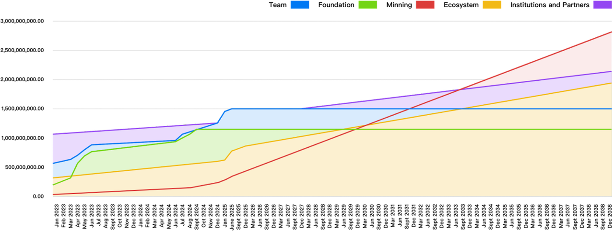

# 代币的释放

* 代币的释放 = Token Distribution/Free/Emission 
  * 释放的逻辑 
    * 市场流通量（Supply）对币价是有关联，按照基本供需法则 
      * Supply降低时币价应该提升 
      * Supply提升时币价应该要降低 
  * 不同方面的期望 
    * 对代币持有者来说则希望代币可以尽快被释放 
    * 对项目来说会希望Supply不要成长太快 
      * 但项目势必需要释放代币给投资者、团队、社群 
  * 总结 
    * 项目应该长时间、渐进式、按照一定顺序进行代币释放 
  * 释放方式 
    * 常见 
      * 同样模拟Shares，就有所谓的Vesting机制 
        * 常见模式 
          * 4年的Vesting以及1年的Cliff 
      * 详解 
        * Vesting 
          * 即使 
            * Token 可以用合约实现vesting的功能，crypto项目常见的是2–6年的Vesting，团队的vesting period应该大于投资者和其他人 
            * 太短的vesting period可能代表团队和投资者不打算长期经营该项目 
            * 而释放给社群的代币，常见是透过空投（Airdrop）或Liquidity Mining 
          * 举例 
            * 空投的代币大部分没有Vesting，像是Uniswap直接释放了 15% token 透过 Airdrop，这让 Supply 一下提升很多，且现在很多撸空投的用户（羊毛党），其使用产品只是为了获得空投，这类型用户高机率会在释放后就将代币卖掉。 因此现在新的项目也会将发给社群的代币加上限制，像是GMX发行的exGMX其会在1年的期间线性释放。 而Safe将空投的代币分为两部分，一半可以马上领取，另一半分4年线性释放，且马上领取的部分目前并不能转移。 将释放给社群的代币也采用vesting方式，可避免Supply短时间提升太多，以及降低对羊毛党的吸引力。 
          * 合理的vesting period  
            * 社群 (短期奖励) < 投资者 < 团队 < 社群 （长期奖励） 
      * 举例 
        * Compound的COMP 
          * 
        * UNI Token 
          * 10年后 
            * 
        * MAP Protocol的MAPO/MAP 
          * 
          * 
    * 特殊 
      * Fair Launch 
        * 在代币发行（Token Launch）时就将 100% 的代币全部发出 
      * 举例 
        * Yearn 
          * 产生问题： 
            * 团队没有任何Token，因此没有诱因继续开发产品，项目也没有Token进行募资或直接支付给团队以继续开发和维持产品 
          * 解决办法 
            * 后来透过DAO提案增发了Token
