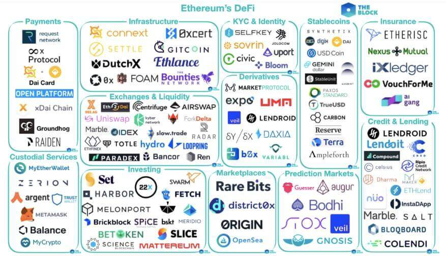
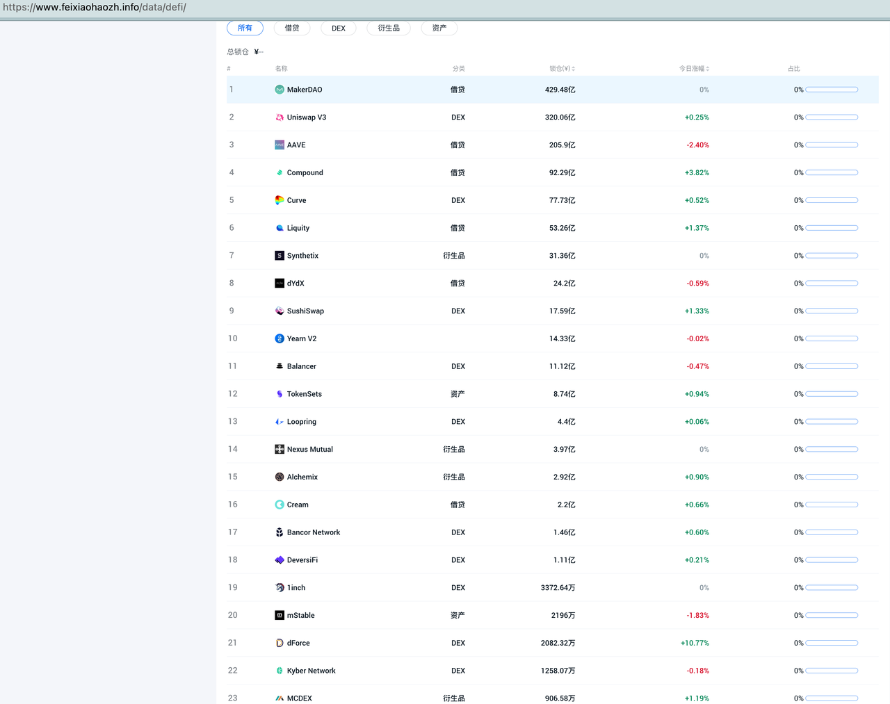
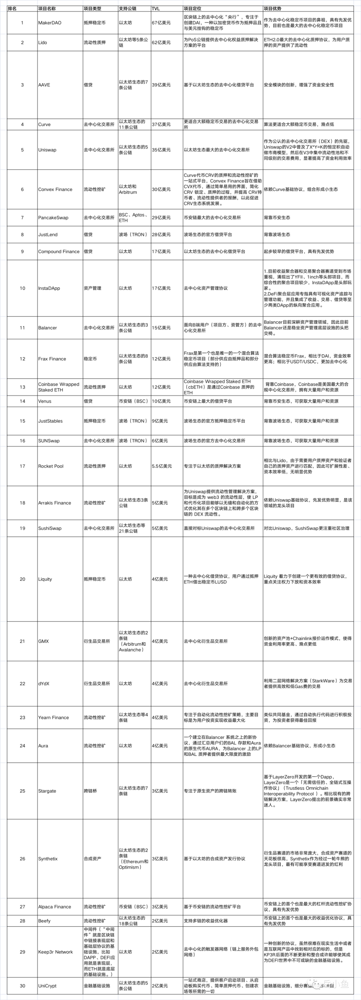

# DeFi生态=用途=领域

* DeFi平台 的 应用方向=领域
  * 作用=用途== （加密货币市场提供）提供金融服务 
    * 全球支付=跨境支付 
      * 虽然这是加密技术提出的最古老的消费者主张之一，但其潜力未得到广泛挖掘。我们的世界经济已经变得高度全球化，各国之间相互联系紧密，加密货币跨境转账在时间、金钱和其他效率方面带来的好处还有待实现。从在国外工作的家人将钱打回家，到国际学生学费，再到公对公巨额转账，加密货币提供了一种互联网原生的支付渠道。 
    * 借贷 = 借款 / 贷款 
      * 允许人们向他人借出或借入资金 
      * 用户既以出借人也以贷款人的身份参与 
      * 举例 
        * 在 DeFi 中，贷款可以像访问 DeFi DApp 一样简单，存入一些加密货币作为抵押品，然后立即以其为抵押进行借贷。他们不是从银行借来的资产，而是来自通过借出资产参与生态系统的其他用户……并因此赚取利息 
    * 交易 
      * 交易加密货币 
    * 交换 
      * 用一种代币换取另一种代币（例如用以太币换取 Dai 币） 
    * 衍生品= 衍生物 
      * 质押 
        * 在类似储蓄的账户中获得利息 
        * 存入代币以保护网络或赚取利息 
    * 流动性池 
      * 为用户提供流动性，以便交换代币 
    * 套利 
      * 确保不同市场间代币价格的稳定 
    * 跨链桥 
      * 从其他网络或向其他网络发送和接收资产 
    * 产生收益的代币 
      * 去中心化金融资产，在持有的普通资产基础上提供某种形式的奖励 
  * 基于以太坊的 
    * 生态
      * 
      * 
    * 文字 
      * 借贷
        * 借贷
      * DEX=去中心化交易所
        * Uniswap V3 
        * Curve 
        * SushiSwap 
        * Balancer
        * Loopring 
        * Bancor Network 
        * DeversiFi 
        * 1inch 
        * dForce 
        * Kyber Network 
      * 衍生品
        * Synthetix 
        * Nexus Mutual 
        * Alchemix 
        * MCDEX 
      * 资产 
        * TokenSets 
        * mStable 
      * 其他方向？
        * 稳定币 
        * KYC/AML
        * 支付平台
        * 市场预测平台
  * DeFi 项目
    * TOP30 项目 
      * 
    * 结论 
      * 细节 
        * （1）不同赛道的比例 
          * 最大的赛道是交易（共 8 个项目）和借贷（共 7 个项目） 
          * 交易所、借贷平台、稳定币被称为公链的三板斧，很多新公链都会标配这三种项目；Uniswap 和 Curve 是交易赛道的龙头，MakerDAO、AAVE 和 Compound 是借贷赛道的龙头。其中交易赛道又可以分为现货交易和衍生品交易，对比传统金融市场，衍生品交易量是现货交易的 10 倍以上，因此 dYdX、GMX、Synthetix 这类衍生品交易所未来会有非常大的成长空间。 
        * （2）不同公链的比例： 
          * 最大的生态是以太坊 Ethereum（共 24 个项目），其次是币安链 BSC（共 3 个项目）和波场 TRON（共 3 个项目） 
          * DeFi 与以太坊可以说是相互成就，在 DeFi Summer 之前，市面上出现了很多号称“以太坊杀手”的新公链，核心是为了解决以太坊速度慢、费用高的问题；但是在 DeFi 兴起之后，很多 DeFi 项目都选择建设在当时的行业龙头以太坊上，由此以太坊生态更加繁荣，以太坊作为公链龙头的位置也更加稳固了。 
        * （3）项目优势 
          * 不同项目能够在同类竞品中脱颖而出的原因大概有三种，技术优势、先发优势和资源优势，但长期来看，还是要靠技术优势； 
          * 典型如币安生态的 PancakeSwap、波场生态的 JustLend，虽然可以在自己的公链生态中一家独大，但是由于没有显著的技术优势，因此难以扩展到其他公链生态，增长空间有限，只能依靠本生态的发展，一荣俱荣、一损俱损。 
        * （4）代币经济模型 
          * 基本上所有项目都会通过项目代币将项目收益分配给用户，这样不但可以吸引新用户使用项目，同时可以为平台提供流动性；但是个别项目没有发币或者没有将项目收益分配给用户，典型如 Uniswap，其代币 UNI 只有治理效用，这就导致 Uniswap 遭受到了竞争对手 SushiSwap 的吸血鬼攻击（通过代币将平台收益分配给用户，收益率更高），大量流动性迁移到 SushiSwap； 
        * （5）可组合性 
          * 不同的协议可以相互组合使用，并基于基础协议形成了一个个小生态；越来越多的 DeFi「工具式应用」围绕着单个底层的「超级 DeFi 协议」进行开发，通过辅助其完善更为丰富的高级衍生功能，从而依托这些个底层的「超级 DeFi 协议」发展壮大，并最终反哺底层的「超级 DeFi 协议」实现更大赋能，逐步发展出一个个独具特色而又自成体系的「小生态」。正如 Uniswap+ Arrakis Finance 之于资产自由交易，Curve+Convex 之于稳定币兑换等等，这些一个个小生态之间现在又正在发生着更进一步的「合纵连横」。 
      * 整体看：更高的资金利用效率 + 更低的交易成本 
        * 不论各类金融应用的底层运作机制怎样创新，都是围绕着更高的资金利用效率和更低的交易成本，这是金融产品在竞争中脱颖而出的关键。 
  * 通用 
    * 借贷平台/产品：涉及到 
      * 资金池问题 
      * 通证经济模型 
      * 平台治理问题 
      * 安全性问题 
      * 社区建设问题 
