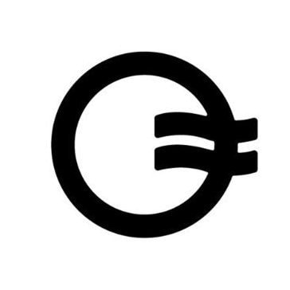

# DEX

* DEX=Decentralized Exchange=去中心化交易所 
  * 类似：传统金融中的：银行、金融机构等 
  * 交易如何进行：通过=依赖于 智能合约 
    * 去中心化交易所无需中央权威机构运作。它们不使用受信任的第三方来保护交易中的资金，而是使用代码。只有当支付得到保证时，卖方的 MAP/ MAPO 才会转移。这种代码被称为智能合约。更多关于智能合约的信息。要使用 DEX，你需要一个钱包来开始。 
  * 常见DEX 概述
    * Uniswap V3 
    * Curve 
    * SushiSwap 
    * Balancer 
    * Loopring 
    * Bancor Network 
    * DeversiFi 
    * 1inch
    * dForce 
    * Kyber Network 
  * 常见DEX 详解
    * Uniswap
      * 详见：Uniswap
    * Curve 
    * Balancer
      * 详见：Balancer
    * PancakeSwap 
    * SUNSwap 
    * SushiSwap 
    * ParaSwap 
      * Logo 
        * 
      * 概述 
        * Best For Low-Cost Swaps (Outside US) 
        * ParaSwap is a DEX aggregator, meaning the platform compares swaps from across the DEX universe. Choose a token pair and quantity, and ParaSwap shows you a rank-ordered list of DEXs that can support the trade, routing your trade to the best choice. ParaSwap also supports limit orders. The downside: ParaSwap blocks transactions from US IP addresses. 
        * In a word: limit orders. Okay, two words. Other DEXs offer similar routing for swaps, choosing the most efficient swap out there. But many don’t support limit orders that let you choose an exact buy or sell price for your swap. The caveat: If you choose a limit price outside the trading range, your order might sit there until the end of time. Be sure to set a date for expiry. 
      * 优缺点 
        * Pros 
          * Supports limit orders 
          * No fee for limit orders 
          * Automatically selects the best choice, but lets you compare 
        * Cons 
          * US traders blocked from transactions 
          * Fees for outside DEXs not displayed 
      * 适用于 
        * People who want to use limit orders 
          * Due to automated market makers (we discuss those in a bit), DEX pricing isn’t exactly a precise tool. If you’re an exacting type of trader. You can set the price you want with a limit order. 
        * People who want peer-to-peer orders 
          * Struck up a deal with someone to swap some crypto? Use Paraswap’s OTC feature to set up a peer-to-peer transaction that’s safe. Your funds stay in your wallet until the trade is executed for both parties. 
    * CoW Swap 
      * Logo 
        * 
      * 概述 
        * Best For Peer-To-Peer Swaps 
        * If you live in the ETH world, your ETH is more valuable than gold. CoW Swap lets you save your precious ETH by paying for any fees with the tokens you’re selling. 
        * CoW Swaps does something different: The CoW protocol helps prevent frontrunning, which is a common occurrence that quietly costs traders money every day. Bots run around the internet looking for profitable trades that haven’t been validated yet. Then, these diabolical bots duplicate the trade with a higher gas fee, jumping ahead in line. The result: a sub-optimal trade for you — and profits for the bot. It’s called Maximal Extractable Value (MEV), and CoW prevents this from happening by executing peer-to-peer trades as well as using batch auctions. 
      * 优缺点 
        * Pros 
          * No charge for failed transactions 
          * No fee for limit orders 
          * Peer-to-peer swaps 
          * Prevents frontrunning 
        * Cons 
          * Limited blockchain support 
      * 适用于 
        * Ethereum users: For now, CoW Swap is mostly an Ethereum thing. Gnosis is also supported, but Abritrum, Polygon, and Optimism users have to swap elsewhere. Mooo. 
        * People who want to use limit orders: The feature is still in Beta (read: might be broken), but limit orders are live on CoW Swap. And they’re free. CoW Swap executes the limit order trade with a small spread, giving you an exact-price swap without fees. 
    * Firebird Finance 
      * Best For DEX Newbies 
    * OpenOcean 
      * Logo 
        * 
      * 概述 
        * Best For cross-Chain Swaps 
        * OpenOcean is a DEX aggregator that helps you find the best swap rates on 20 supported blockchains. You can even do cross-blockchain swaps. (More on that later.) 
        * If you need support for more blockchains, OpenOcean has you covered. In total, this DEX aggregator supports 20 blockchains ranging from Ethereum and layer 2 networks to Solana and Tron. 
        * CoW stands for Coincidence of Wants, and it’s the key to low-cost swaps on CoW Swap. This clever protocol matches swaps without using liquidity pools whenever possible. If there isn’t anyone else who wants to swap the same tokens, then CoW Swap becomes a DEX aggregator, helping you find the best deal elsewhere. Nice. CoW Swap also supports limit orders, so you can just wait for the right price. 
        * OpenOcean is reminiscent of UniSwap, with a clean interface that puts fine control over your trade just a click away. Where it differs from Uniswap is that OpenOcean is an aggregator. The app also supports cross-chain swaps. If you have tokens on Blockchain A, you can swap them for tokens on Blockchain B. That’s powerful stuff. 
        * Swaps, limit orders, cross-chain swaps, leveraged perpetual swaps — what’s not to like? The main downside to using OpenOcean is that maybe it does too much. This isn’t the place to send your buddy from work who wants to learn how to DeFi. But if you’ve got a bit of crypto experience under your belt, OpenOcean gives you plenty of toys to play with and a suite of tools to maximize your trading profits. 
      * 优缺点 
        * Pros 
          * Cross-chain swaps 
          * Limit orders 
          * 20 blockchains supported 
        * Cons 
          * Doesn’t always detect tokens in wallet 
          * Confusing for newbies 
          * Minimum trade amounts 
      * 适用于 
        * People who use multiple blockchains 
          * Remember when you got to the register at a store and then realized you left your wallet in the car? Crypto is like that. Sometimes the funds you need are somewhere else, sitting on another blockchain. OpenOcean is like sending your buddy out to the car to get your wallet. Problem solved. Now you can use your funds. OpenOcean lets you swap tokens like a superhero, leaping across blockchains. And you only have to wait a few minutes. 
        * People who use limit orders 
          * OpenOcean aggregates the liquidity pool inventory of more DEXs than you can count, but sometimes you want a specific price point. OpenOcean lets you create limit orders at a specific price point, which can be handy in a volatile market. 
    * 1inch
      * 详见：1inch
    * Firebird Finance 
      * Logo 
        * 
      * 概述 
        * Best For DEX Newbies 
        * Earn cash back in FBA tokens while finding the best price and routing for your swaps. Firebird Finance gives you the big picture in a clean interface. This DEX aggregator also shows you how close your trade is to open market prices. If there’s an unfavorable change in price before your swap completes, Firebird Finance reverts the trade. Fire, indeed. 
        * Firebird Finance rewards users with tokens you can stake to earn a percentage of earnings from the protocol. And with nine popular blockchains supported, those earnings create passive income as the platform grows. The Firebird interface is pleasant to use and shows the routing for your trade. A handy price chart helps you understand the price direction before you click the swap button. 
      * 优缺点 
        * Pros 
          * Compare swap price to outside market 
          * Automatically cancels the trade if the price changes unfavorably 
          * Earn FBA tokens for trades 
        * Cons 
          * Easy-to-miss slippage settings 
          * Doesn’t display DEX choices for swaps 
          * Limited tokens 
      * 适用于 
        * People who want a passive yield 
          * Buy or earn FBA tokens you can stake to earn a percentage of the protocol’s earnings. 
        * Traders on Cronos or Fantom blockchains 
          * Ethereum and Abitrum DEX aggregators are easy to find. But for still-growing blockchains like Cronos (17 DEXs) or Fantom (16 DEXs), Firebird Finance can be a lifesaver, allowing you to find the best prices on swaps. 
* 相关 
  * 中心化交易所 + 去中心化交易所 
    * Binance 
    * Bybit 
    * OKX 
    * Kraken 
    * Kucoin 
