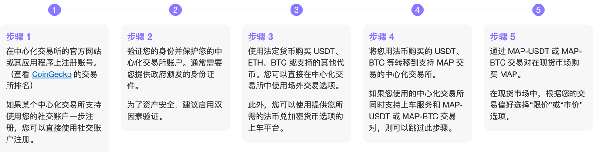

# CEX

* CEX=中心化交易所 
  * 所属：DeFi领域 
  * 常见=包含 
    * Bithumb 
    * Coinone 
    * HTX 
    * Bitget 
    * Gate.io 
    * MEXC 
    * KuCoin 
    * DeGate 
    * LBank 
  * 在 CEXs 上的交易步骤 
    * 由于不同 CEXs 的操作程序各不相同，我们无法为你提供在所有 CEXs 上购买代币的逐步指南，但以下是一些通用步骤。 
    * 某些 CEX 可能在你的国家或地区不可用，你可以咨询交易所的客户服务或查看交易所的公告。至于税务问题，你也可能需要咨询当地部门以获取更多信息。 
      * 概述 
        * 
      * 详解 
        * 步骤 1 
          * 在中心化交易所的官方网站或其应用程序上注册账号。（查看 CoinGecko 的交易所排名） 
          * 如果某个中心化交易所支持使用您的社交账户一步注册，您可以直接使用社交账户注册。 
        * 步骤 2 
          * 验证您的身份并保护您的中心化交易所账户。通常需要您提供政府颁发的身份证件。 
          * 为了资产安全，建议启用双因素验证。 
        * 步骤 3 
          * 使用法定货币购买 USDT、ETH、BTC 或支持的其他代币。您可以直接在中心化交易所中使用场外交易选项。 
          * 此外，您可以使用提供您所需的法币兑加密货币选项的上车平台。 
        * 步骤 4 
          * 将您用法币购买的 USDT、BTC 等转移到支持 MAP 交易的中心化交易所。 
          * 如果您使用的中心化交易所同时支持上车服务和 MAP-USDT 或 MAP-BTC 交易对，则可以跳过此步骤。 
        * 步骤 5 
          * 通过 MAP-USDT 或 MAP-BTC 交易对在现货市场购买 MAP。 
          * 在现货市场中，根据您的交易偏好选择“限价”或“市价”选项。 
  * 举例 
    * 获取MAPO代币 
      * ERC-20 MAP（ MAP Protocol 在以太坊上的原生代币 ） 
        * Kucoin 
          * https://www.kucoin.com/ko/trade/MAP-USDT
        * Bithumb 
          * https://www.bithumb.com/react/trade/order/MAP-KRW
        * Coinone 
          * https://coinone.co.kr/exchange/trade/map/krw
        * HTX 
          * https://www.htx.com.bo/en-us/trade/map_usdt?type=spot
        * MEXC Global 
          * https://www.mexc.com/exchange/MAP_USDT?_from=search
      * MRC-20 MAPO（ MAP Protocol 在 MAP 中继链上的原生代币，因此是 MAPO 主网 ） 
        * LBank 
          * https://www.lbank.com/trade/mapo_usdt/
        * Bitget 
          * https://www.bitget.com/spot/MAPOUSDT
        * Gate.io 
          * https://www.gate.io/trade/MAPO_USDT
