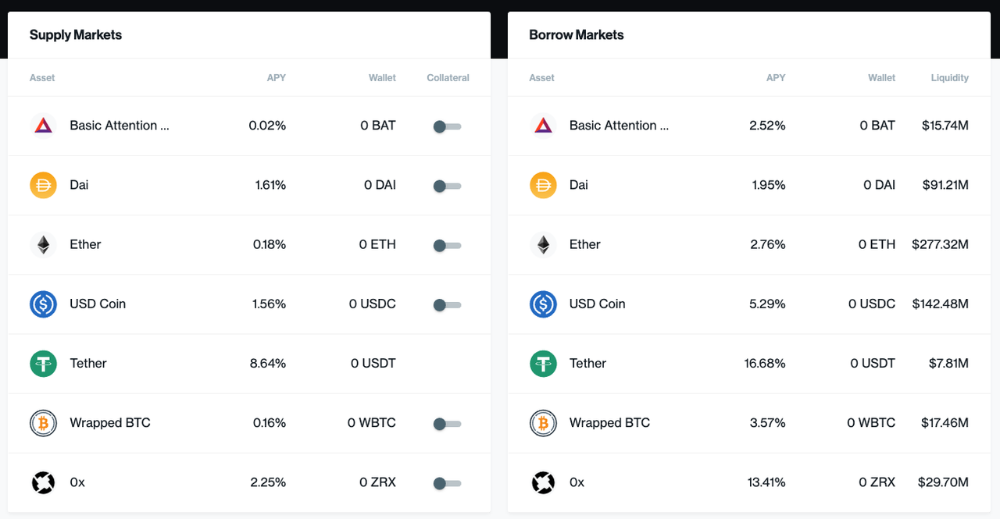
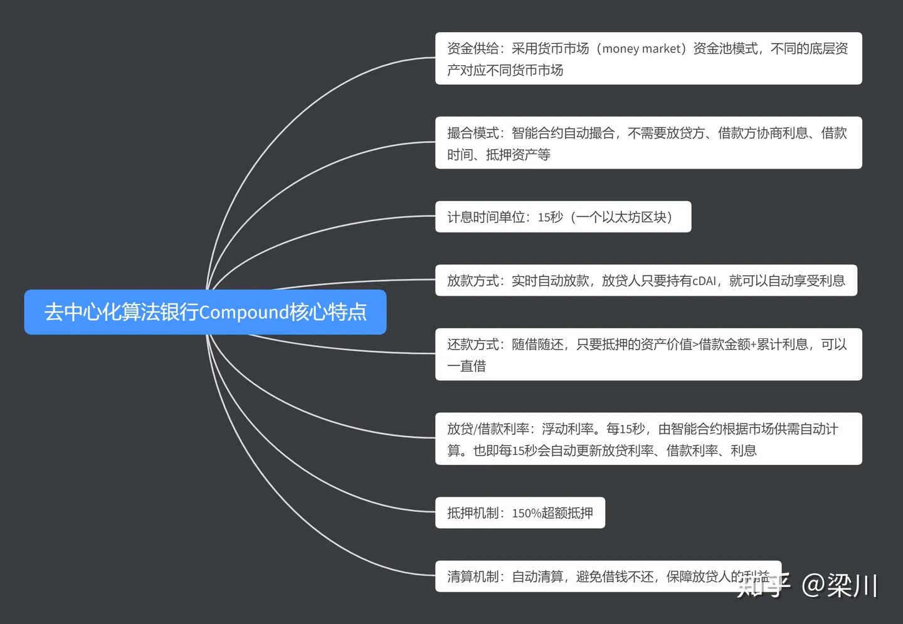

# Compound

* Compound 
  * 是什么：DeFi领域内，一个开放性金融借贷协议
  * 概述 
    * 成立于2018年9月，并在2019年11月从Andreessen Horowitz、Bain Capital Ventures、Polychain Capital和Paradigm等风险投资公司筹集资金2500万美元
    * Compound支持8种代币ETH、USDC、DAI、REP、WBTC、SAI、ZRX和BAT的借贷，用户可以通过抵押一种代币借出另一种代币
  * Token代币：COMP
  * 主页 
    * Compound
      * https://compound.finance
        * 
  * 要点 
  * 与点对点借贷市场的根本区别在于，它让拥有一种资产的人可以借入另一种资 
  * 类比：区块链去中心化银行 
  * Compound核心特点 
    * 
  * 收入来源：利息差 
    * 而用户的存款利息和贷款利息之间差额的利息，构成了Compound的收入 
    * 举例 
      * 用户在Compound上存入100USDT，可以获得8%的年收益；在平台上借出100USDT，则需要支付13%的利息。差额的5%的利息，就为Compound的收入 
  * 盈利 
    * 手续费 
    * API组件 
  * 资料
    * 白皮书
      * Compound.Whitepaper.pdf
        * https://compound.finance/documents/Compound.Whitepaper.pdf
    * 文档 
      * Compound v2 
        * https://docs.compound.finance/v2/
      * Compound v3 
        * https://docs.compound.finance
    * 代码 
      * Compound III = Compound v3 = comet 
        * https://github.com/compound-finance/comet
