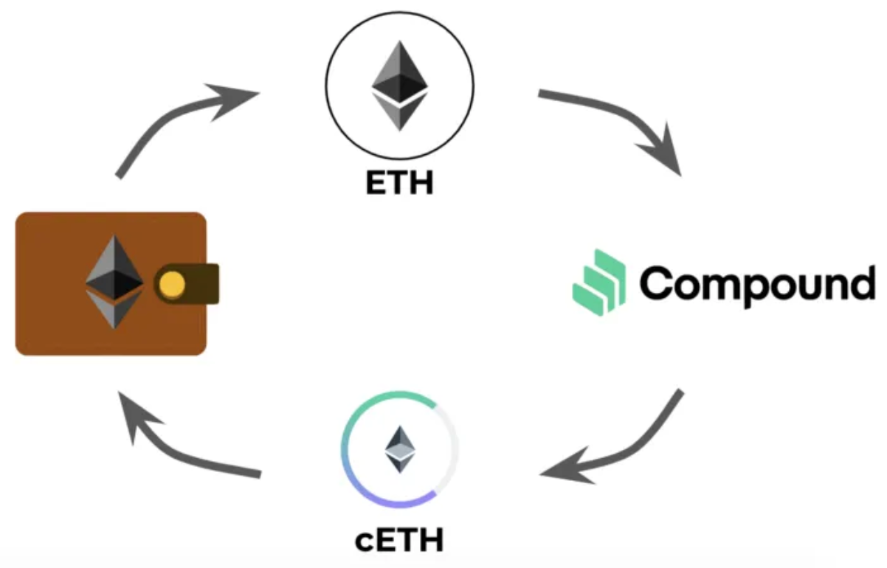
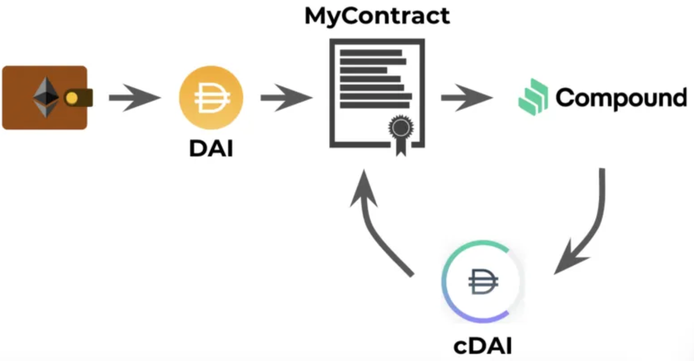
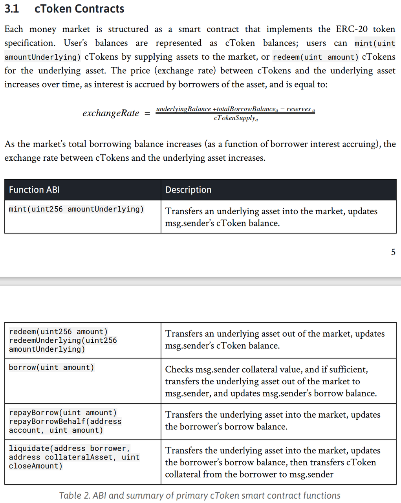

# cToken

* cToken 
  * 是什么：DeFi领域中借贷协议Compound中的凭证 
    * 类比：存钱进银行，银行给你的收据=存单 
  * 逻辑概述 
    * 当你向Compound协议存款时，就会得到 cTokens，例如cEther、cDAI等，这些Defi协议代币通常就是标准的ERC20代币，它们 在Defi协议运作中发挥着重要的作用。例如在Compound协议中，cEther或cDAI分别用来 表示你向协议存入的以太币或DAI，被称为标的资产（underlying assets）。这些cTokens 就像Defi协议开给你的收据，这样你在将来就可以用它赎回存款。另一个作用是跟踪你的 存款的利息 
  * 注意事项 
    * 当你使用存款作为抵押物来借出其他资产时，发给你的cToken就不可以转账了 
      * 这也容易理解，因为既然作为抵押物了，你的标的资产就 被锁定，直到你的债务还清 
      * 如果在此期间cToken还可以转账就有问题了，因为这些代币的接收方可能压根就不知道这些cTokens已经被抵押了 
    * 不能轻易把cToken转给别人 
      * 因此如果你将这些cTokens转给别人，也就意味着你将存款收据给了别人， 别人也就可以赎回你的目的资产了。因此一定要小心处理这一块 
  * 作用 
    * 跟踪你的存款的利息 
    * 用它赎回存款 
      * 在基于Web3的去中心化网络里，你的Wallet就是你的身份证件，凭借cToken和Wallet你就能向Compound协议要求赎回本金和收益 
  * 类比 
    * 我们去银行柜台买理财，存入一万元，银行给你一张凭证，凭此凭证和你的身份证件，到期后可以要求兑换本金和收益。cToken对应的就是那张凭证 
  * 举例 
    * 以USDC借贷市场为例，假设初始时1 cUSDC = 1 USDC，随着借贷池里利息收入(USDC)的增长，cUSDC对USDC的兑换比例会随着时间越来越高。比如用户最初存入1000 USDC，拿到1000 cUSDC 作为兑换凭证。一年后，1 cUSDC = 1.2 USDC，用户想要套现，就调用Compound协议的赎回功能，此时的1000 cUSDC代表的USDC为1200 USDC，所以用户最终拿回1000 USDC的本金和200 USDC的利息收入 
  * 说明 
    * 整个过程全部基于智能合约的公开可验证的逻辑，不需要任何人员和机构参与这个过程来帮助验证身份、确认权益、发放收益 
    * 图
      * 
      * 
  * 更新时间 
    * 概述 
      * 每十几秒这些利率会被更新一次 
    * 详解 
      * 至于cToken对它代表的的底层资产兑换比例的设定和更新，Compound智能合约会在每产生一个新以太坊区块时根据那个时间点池子里累计的本金和利息更新每个市场里的cToken的兑换比例 
      * 类似传统银行柜台每个工作日早上在小黑板上更新最新的理财收益率，Compound智能合约是在每个以太坊新区块形成时更新最新的Borrow Rate和Supply Rate。通常十几秒会出一个新区块，也就是说每十几秒这些利率会被更新一次 
  * cToken的好处 
    * 直接在DEX交易 
      * 由于cToken和它代表的底层资产都是ERC20代币（一种基于以太坊的常见token类型），意味着用户可以直接转移和交易cToken，比如可以直接在某些去中心化交易所（DEX）里直接交易成想要的币种。这个类似于债券市场，可以等到债到期后拿回本金和利息，可以直接在债券市场里买卖债券，获得更好的流动性 
    * 配合冷钱包，保存更安全 
      * cToken也可配合cold storage使用，冷储存是一种流行的保管加密货币资产的渠道，通过把钱包私钥保存在一个离线的硬件里，黑客就无法盗取用户的钱包。与其保存底层资产比如ETH，不如在离线钱包里保存cETH，这样即使钱包一直离线里面的cETH能像一个永动的余额宝般给用户提供资产保值甚至增值服务。 
  * 开发细节 
    * cToken智能合约 
      * 
