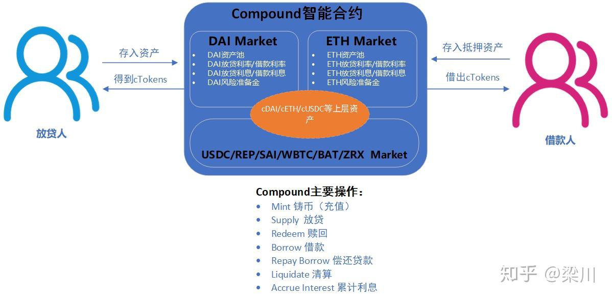
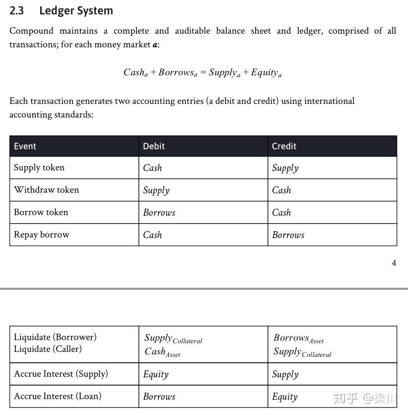

# 流程和逻辑

* Compound 借贷协议 
  * Compound核心逻辑 
    * 概述 
      * 根据用户存储到Compound智能合约的货币市场（Money Market）的底层资产（Underlying Asset），智能合约按照兑换率发放对应数量的由Compound铸造（Mint）的cToken到用户账户。持有cToken用户可以收取利息，也可以随时赎回（Redeem）Token，也可以设置作为抵押物（Collateral）借出（Borrow）其他cToken 
    * 详解 
      * 放贷人（Suppliers）/借款人（Borrowers）存入资产到Compound 智能合约的货币市场（Money Market）。放贷人/借款人存入的资产为底层资产（underlying asset）。Compound目前支持USDC/REP/SAI/WBTC/BAT/ZRX 
      * 智能合约按照兑换率发放对应底层资产的Compound代币cTokens到用户账户。这里的cTokens可以为cDAI/cETH/cUSDC/cREP/cSAI/cWBTC/cBAT/cZRX 
      * 放贷人存入资产到Compound 的货币市场（Money Market）中可以享受放贷利息收益，由Compound自动撮合贷款需求。 
      * 借款人超额抵押资产后，可以从Money Market借款。不同于P2P借款，借款人不需要和贷款人协商，只要对应Money Market的流动性足够，由Compound 智能合约自动撮合。借款利率由Compound智能合约根据市场对资金的供需关系实时确定。同一区块内，所有借款人的借款利率都是相同的。 
      * Compound按照区块数为单位累积借款人利息（Accrue Interest）。 
      * Compound 对每一笔借款都会计提准备金（Reverse） 
      * 放贷人可以随时赎回（Redeem）自己存入的底层资产 
      * 借款人可以随时偿还贷款（Repay Borrow） 
      * 如果借款人抵押资产价值低于清算阀值，Compound智能合约会自动发起清算操作（liqudate） 
  * Compound核心架构 
    * 
  * Compound核心概念 
    * 账本系统 
      * Compound账本遵循复式记账法的基本公式：资产=负债+所有者权益 
        * 
