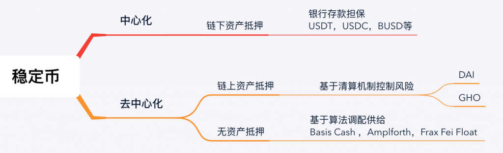

# 稳定币

* 稳定币=Stablecoin 
  * 背景 
    * 加密货币（比特币、以太币等）大多都是高波动性=价格变化很大=价格波动很大 
  * 是什么：一种旨在保持稳定价值的加密货币 
  * 评价 
    * 在波动的加密货币世界中，稳定币如一盏稳定的明灯 
    * 稳定币在传统金融和创新的加密货币世界之间架起了一座桥梁，提供了两个领域的最佳结合：法定货币的稳定性与区块链的效率、透明性和安全性。 
    * 无论是用于交易、对冲波动性，还是使去中心化金融活动成为可能，稳定币在更广泛的加密货币生态系统中被证明是不可或缺的。 
  * 实现机制=不同种类 
    * 概述 
      * 
    * 详解 
      * Fiat-collateralized=法币抵押=法币稳定币=与法币挂钩 
        * 这些稳定币保持着传统法定货币如美元或欧元的储备，比例为1:1。每发行一个稳定币，就有相等的法币在储备中 
        * 举例 
          * 美元 
            * USDT=Tether 
              * 详见：USDT
            * USDC 
              * 详见：USDC
            * TUSD 
              * 详见：TUSD
            * BUSD 
              * 详见：BUSD
            * SUSD 
              * 详见：SUSD
          * 欧元 
            * EURS 
            * EUROC 
          * 中国人民币=CNHT 
      * （大宗）商品挂钩 
        * 这些稳定币挂钩如黄金或银这样的资产 
        * 举例 
          * PAX Gold=PAXG 
            * 每个代币代表一盎司黄金 
      * Crypto-collateralized=加密货币抵押 
        * 这些由其他加密货币支持，通常是以太坊或其他主要资产。它们进行了超额抵押，以应对支持加密货币的波动性。 
        * 举例 
          * DAI 
            * $DAI 的抵押品是存入 MakerDAO 金库中的 $ETH 
          * GHO 
            * AAVE的GHO 
              * 详见：稳定币GHO
      * Algorithmically-controlled=算法控制=算法稳定币 
        * 这些稳定币没有任何储备支持，而是使用算法和智能合约自动调整稳定币供应，旨在保持其价格稳定。 
          * 依靠算法和智能合约来保持其价格与法币相同 
          * 如果算法稳定币的价格低于其挂钩的法定货币的价格，其流通供应量将减少以提升价格，恢复挂钩 
        * 举例 
          * AMPL=Ampleforth 
          * FRAX 
            * 与美元挂钩的 $FRAX 的价格部分由抵押品支持，部分由算法稳定 
          * USTC 
            * $USTC（以前被称为 $UST）是一个“著名”的失败的算法稳定币项目 
              * 其于 2022 年 5 月与美元脱钩，尚未恢复。 
  * 如何获取 
    * 加密货币交易所 
      * 大多数主要的加密货币交易所如 Coinbase、Binance 和 Kraken 允许用户用法币购买稳定币或将它们换成其他加密货币。 
    * 直接发行 
      * 一些稳定币项目，特别是那些法币抵押的，允许用户直接从其平台购买稳定币。 
    * 通过利息赚取 
      * 像 Compound 或 Aave 这样的平台允许用户通过提供流动性或参与借贷活动来赚取稳定币作为利息 
