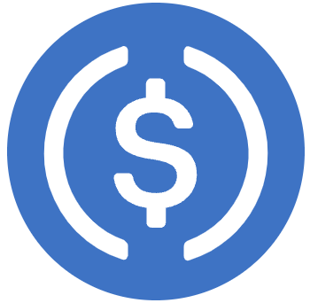

# USDC

* USDC=USD Coin
  * Logo
    * 
  * 是什么：美元挂钩的数字稳定币 
    * 加密货币中的其中一种稳定币 
  * 出现时间：于2018年5月15日由Circle (公司)首次宣布，并于2018年9月推出 
  * 所在区块链：可在以太坊，Stellar，Algorand，Hedera Hashgraph和Solana区块链上运行 
  * 目标：完全取代法定货币 
  * 注意 
    * 在Circle宣布在破产的硅谷银行（SVB）浪费了33亿美元的储备金后，USDC稳定币失去了此前与美元的挂钩 
  * 市场发展 
    * 2021年3月29日，Visa宣布将允许使用USDC在其支付网络上结算交易。 
  * 流通量 
    * 截至2022年1月，流通中的USDC为452亿美元 
