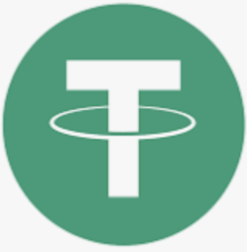

# USDT

* USDT=Tether=泰达币 
  * Logo
    * 
  * 是什么：一种资产支持的加密稳定币 
    * 最初设计的价值为1美元 
      * 和美元1:1 
        * 泰达公司声称，每发行1美元的泰达币，他们会相对保留1美元的资产储备 
  * 出现：于2014年由泰达股份有限公司推出 
    * 所属公司：泰达公司隶属于香港iFinex公司 
      * 该公司还拥有Bitfinex加密货币交易所 
    * Tether Limited = 泰达股份有限公司 
      * 支持四种稳定币 
        * 美元：USDT 
        * 人民币：CNHT 
        * 欧元：EURT 
        * 1盎司黄金：XAUT 
  * 发展情况 
    * 截至2022年7月，泰达公司已在10个协议和区块链上铸造了USDT稳定币 
    * USDT在全球超过400个交易所和平台上进行交易，并支持超过10种不同的区块链协议 
  * 发行量 
    * 截至2022年7月4日，USDT的总发行量为66,081,540,012.39枚，总市值为66,081,540,012.39美元 
      * 在所有加密数字货币中排名第三，仅次于比特币和以太坊 
  * 交易量 
    * 24小时交易量为72,038,000,000.00美元 
      * 在所有加密数字货币中排名第一 
