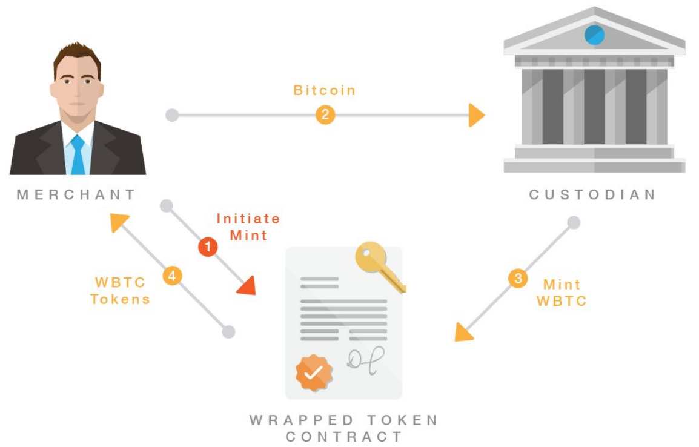
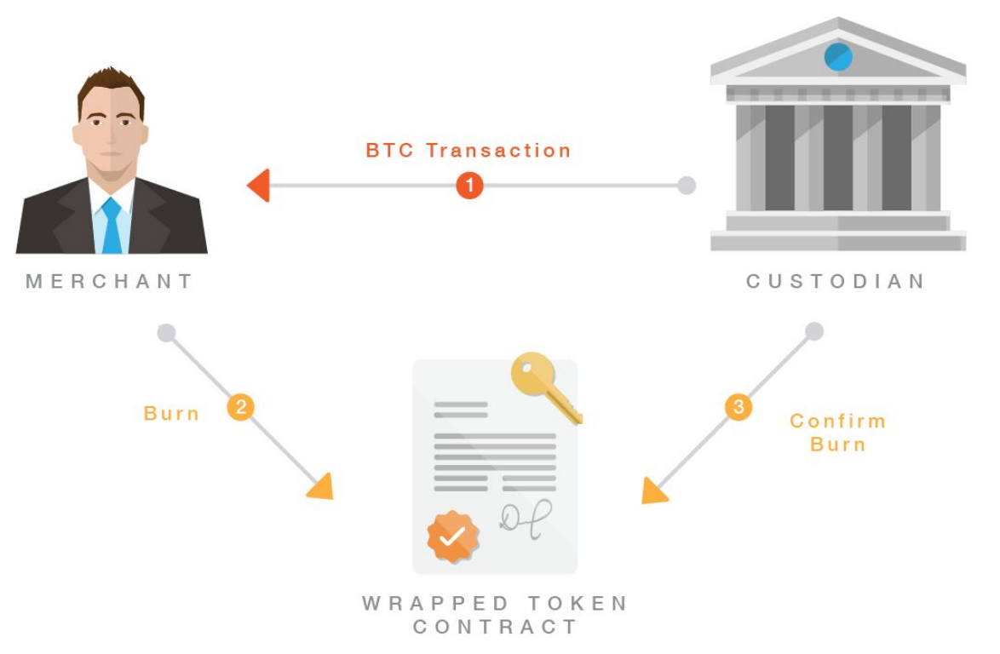

# WBTC

* WBTC=Wrapped Bitcoin=wBTC 
  * = 包装比特币=包装的BTC=包装的比特币=打包的比特币 
  * 是什么：一种以太坊中的，由比特币支持的，和比特币1:1挂钩的，交易要通过CEX的，ERC20代币=数字资产 
    * 注：挂钩=pegged 
  * 发布时间：2019年 
  * 概述 
    * WBTC由BitGo、Kyber Network和Ren(之前名为Republic Protocol)等区块链项目联合推出，该代币在以太坊上发行，实现与比特币1:1挂钩，所有发行的WBTC都会得到比特币的支持，托管人存储的每个比特币都能够与发行的WBTC总数对应，并且可在链上验证，只有经商家批准，托管人才能铸造WBTC，而当持有人将WBTC兑换成比特币时，WBTC将被销毁 
  * 特点 
    * WBTC是一种ERC-20数字资产，由比特币（BTC）1:1支持 
    * WBTC是本项目的原生代币 
      * 目前WBTC的用例包括： 
        * 交易：WBTC作为以太坊生态系统中BTC的等价物，可用于交易 
  * 主要部分组成 
    * 铸币 
      * 用户可以将他/她的BTC发送给商家，商家将发起WBTC铸币请求，并将用户的BTC发送给保管人。保管人随后将铸造相应的WBTC，随后通过商家转给用户 
        * 
        * 
    * 烧毁 
      * 当用户希望用WBTC赎回他/她的比特币时，商家将烧毁WBTC，然后与保管人沟通这一交易。保管人然后将用户的BTC转回给商户，随后再转给用户 
        * 
        * 
    * WBTC DAO 
      * WBTC在Ethereum上的商家和保管人的增加和删除将由WBTC DAO控制 
  * 缺点 
    * 包装的BTC取决于发行它们的智能合约 
      * 换句话说，包装本身不能通过这些智能合约区块链上的智能合约自动完成，而是由一个中央程序完成的，该程序可以进行操作。 
  * 现状 
    * 截至2022年10月19日，WBTC的总代币供应量和流通量为238,013.41 
  * 主页 
    * [Wrapped Bitcoin ( WBTC ) an ERC20 token backed 1:1 with Bitcoin](https://wbtc.network/)
      * https://wbtc.network
        * DO MORE WITH YOUR BITCOIN 
        * Wrapped Bitcoin delivers the power of Bitcoin with the flexibility of an ERC20 token 
        * Wrapped Bitcoin (WBTC) is the first ERC20 token backed 1:1 with Bitcoin. 
        * Completely transparent. 100% verifiable. Community led. 
  * 白皮书 
    * https://www.wbtc.network/assets/wrapped-tokens-whitepaper.pdf
