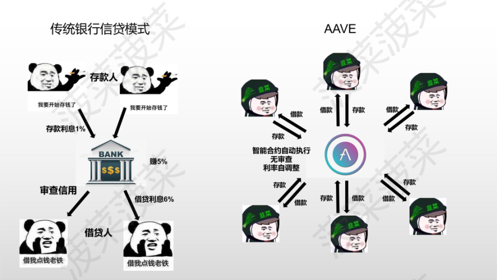

# DeFi借贷协议

* （去中心化）DeFi借贷=借贷协议==借贷平台
  * 概述 
    * 继承了区块链去中心化、去信任化、透明开源等特点 
      * 
    * 去中心化借贷，充当了各个角色之间的枢纽，将 DEX、稳定币、借贷等板块有所连结 
  * （借贷过程中的）三个角色 
    * 1.存款人：为平台提供存款，赚取利息 
    * 2.借款人：超额抵押资产，借出资金，并为存款人付息 
    * 3.清算人：在借款人的抵押资产价值不足时，触发清算规则，出售借款人的抵押品，获得清算折扣利润 
  * 业务=逻辑
    * 核心逻辑 
      * 抵押：先抵押，再借贷 
        * 原因：由于DeFi借贷业务中不存在传统意义上的信用关系体现，因此采用抵押这一原始方式进行担保贷款。 
    * 借贷逻辑 
      * 当借款人返还借款及利息后，将会自动收回锁定的抵押资产。 
      * 由于抵押资产的价格存在波动，一旦其价格低于贷款水平的阈值，则需要借款人补仓，或者会触发智能合约自动清算，此时借款人会持有借款，但会失去抵押资产。 
      * 换言之，如果借款人的借款能力不足，他们的抵押品将拍卖出售，用以偿还债务。 
    * 利率高低 
      * 当借款人对某一加密资产的需求较低时，资金池里的可借贷金额过剩，流动性高，利率会降低，从而鼓励更多贷款 
      * 当借款人对某一加密资产的需求过剩时，可借贷金额降低，流动性低，利率会增加，从而吸引存款人的供给 
  * 效果：（存款人和借款人）双方都受益 
    * 存款人：将闲置加密货币资金存入借贷平台可以获取利息作为额外收益 
    * 借款人： 
      * 借款人除了可以通过借入某种资产 
      * 暂时获得区块链上的更多权力，如治理权等 
  * 超额抵押 
    * 是什么：TODO 
    * 评价、效果 
      * 发起贷款的关键条件 
      * 很大程度上降低了借款人违约的风险 
      * 当以加密资产为抵押品时，借款人提供的超额抵押能够在加密资产价格跌至贷款价格之前提供足够缓冲空间 
    * 举例解释 
      * DeFi平台中主流的超额抵押方式在一定程度上可以处理违约风险。例如，如果借款人要借100美元的ETH，他需要根据DeFi平台的超额抵押率要求，抵押价值超过100美元的其他加密货币，例如150美元的DAI。如果抵押品价值跌破贷款水平，借款人可以存入更多抵押品，或将抵押品出售以维持系统偿还能力。加密资产价格往往存在较大波动性，因此，当以加密资产为抵押品时，借款人提供的超额抵押能够在加密资产价格跌至贷款价格之前提供足够缓冲空间。此外，在区块链平台上清算和拍卖加密资产的时间也应考虑在内。在抵押资产价格大幅波动的情况下，在完成清算之前有可能会出现较大的价格变化 
  * 评估DeFi借贷平台价值的标准或维度 
    * 总价值锁定 (TVL): 
      * TVL 是衡量平台吸引力和用户信任度的关键指标。一个高TVL表明平台拥有大量的活跃资金，是用户广泛采用的标志。 
    * 用户基础和增长率 
      * 用户基础的大小和增长速度可以显示平台的受欢迎程度和市场接受度。快速增长的用户基数可能表明平台具有良好的市场定位和未来增长潜力。 
    * 资产多样性 
      * 提供多种借贷资产的平台能够吸引更广泛的用户群体，提高其市场竞争力。资产多样性也有助于分散风险。 
    * 利率模型 
      * 利率是影响用户选择借贷平台的重要因素。一个公平、透明且对借贷双方都有利的利率模型是评估平台价值的关键。 
    * 流动性 
      * 高流动性意味着用户可以轻松地存入和提取资金。流动性不足可能导致用户体验不佳和资金效率低下。 
    * 安全性和智能合约审计 
      * DeFi平台的安全性至关重要。经过彻底审计且历史上没有重大安全事故的平台更值得信赖。 
    * 治理和社区参与 
      * 去中心化治理结构允许用户参与决策过程，提高了平台的透明度和社区的参与感。活跃的社区和良好的治理机制是长期成功的关键因素。 
    * 平台创新能力 
      * 在快速变化的DeFi领域，创新是保持竞争力的关键。平台的能力来不断推出新的功能、优化现有产品并适应市场变化是一个重要的评估维度。 
    * 合规性和法律风险 
      * 随着监管机构开始更密切地关注DeFi领域，合规性成为一个越来越重要的考量因素。遵守相关法律法规的平台可能面临较低的法律风险。 
    * 跨链兼容性 
      * 随着区块链生态系统的发展，跨链功能使用户能够在不同的区块链平台之间流动资产。支持跨链交互的平台可能会吸引更多用户，增强其市场地位。 
