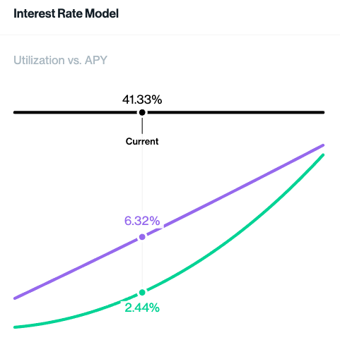

# 借贷利率Borrowing Interest Rate

* 借贷利率=Borrowing Interest Rate = Borrow Rate 
  * 举例 
    * 当借贷率为0时，借贷利息为最低门槛的2.5%，当借贷率为50%时，因为借贷需求很高，此时的借贷利息受此推动上升到12.5% 
      * 在一个供需完全自由化的有效市场里，如果借贷利息上升到12.5%，对于持有该资产的投资者来说，是个非常诱人的低风险投资机会，投资者就会把他们的资产存入Compound的借贷池，Cash就因此增加，导致Utilization下载，借贷利率由此回落，形成一个开放市场对价格调节的一个完整周期 
    * 额外说明 
      * 细心的用户会发现实操中Supply Rate（对标余额宝投资年化收益）总是低于Borrow Rate（借贷利息），就会纳闷这中间的利润去哪了？生活中，A向B借了一万元，承诺5%借贷利息，那么A就能拿到5%的借贷收益。在Compound的模型中，投资者是一起拼团把资金放在了一个共同的池子里，想要借钱的人不是单独和某个投资者借钱，而是和那个池子借钱。假设池子里有一万元，有人按5%的借贷利息借了一千元，还款时归还一千元本金和五十元利息，池子里的人需要平摊那五十元利息，算下来收益率就是 50 / 10000 = 0.5%，也就是借贷利息5%乘以资金利用率（Utilization） 10%。推导一个极端情况，池子里的一万元钱被全部借走，还款时归还一万元本金和五百元利息，此时Supply Rate就等于Borrow Rate，因为资金利用率为100%。 
  * Compound 
    * 公式 
      * Borrowing Interest Rate = 2.5% + Utilization * 20% 
    * 利率模型图 
      * 
