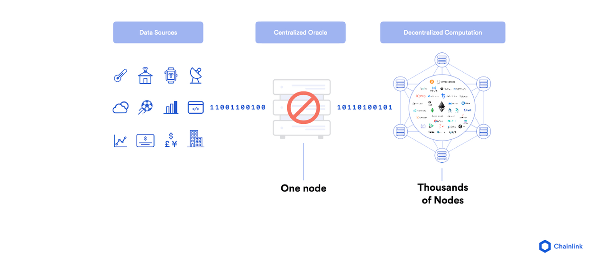

# 预言机Oracle

* 预言机=oracle == Price Oracle=价格预言机
  * 所属范围：Web3/区块链 -> DeFi
  * 背景 
    * 区块链与智能合约无法访问链下数据（区块链网络之外的数据）。然而，对于许多合约协议而言，拥有来自外部世界的相关信息对于执行协议至关重要 
    * 区块链预言机是向智能合约提供外部信息的第三方服务，充当区块链与外部世界之间的桥梁。 
    * 区块链预言机可以在链下和链上数据之间提供链接，因此得以在这方面发挥作用。预言机可以拓宽智能合约的运行范围，在区块链生态系统中至关重要。如果没有区块链预言机，智能合约将只能从其网络内部获取数据，其用途将会受到极大限制。 
    * 由于存在实时计算借款人抵押物的资产价值、放贷人存入底层资产兑换为代币的数量等需求，因此需要实时获取各种底层资产的价格信息 
    * 当一个Defi协议处理不同的资产时，它经常需要了解这些资产的当前价格 
  * 本质：是一种软件
  * 是什么：将链下数据高效地传输到区块链上的一种方法/软件/机制 
    * 可将外部数据转换为智能合约可以理解的语言（反之亦然） 
      * 一些预言机不仅能够将信息传递给智能合约，还能够将信息发送回外部数据源 
  * 支持数据类型 
    * 预言机可传输多种形式的数据，包括价格信息、成功付款数据或由传感器测量的温度数据等 
  * 注意 
    * 区块链预言机并非数据源本身，而是对外数据源进行查询、核实和验证，继而再进行传递的层 
  * 过程 
    * 要从外部世界调用数据，就必须调用智能合约，同时还必须消耗网络资源。 
  * 举例 
    * 假设Alice和Bob打赌谁会赢得美国总统大选。Alice认为共和党候选人会获胜，而Bob则认为民主党候选人将成为赢家。他们就该赌注条款达成一致，并将各自的资金锁定在同一个智能合约中，该合约将根据选举结果将所有资金释放给赌注获胜者。 
    * 由于智能合约无法与外部数据交互，它必须依靠预言机向其提供必要的信息，在该示例中即为总统选举结果。选举结束后，预言机通过查询可信API确认选举结果，并将此信息传递给智能合约。随后，智能合约根据选举结果将资金发送给Alice或Bob。 
    * 如果没有预言机传递数据，便无法以一种参与者无法操纵的方式来进行赌注结算。 
  * 分类 
    * 不同角度 
      * 根据来源分类：数据来源于软件还是硬件？ 
      * 根据信息传递方向分类：是由外向内传递还是由内向外传递？ 
      * 基于信任化程度分类：是中心化还是去中心化？ 
    * 一台预言机可同时归属多种类别 
      * 举例 
        * 从公司网站获取信息的预言机就是一个中心化的入站软件预言机 
  * 预言机问题 
    * 现存问题：如何保障预言机与底层区块链具有同样的安全性和可靠性？ 
    * 是什么：如果用一个中心化的预言机将数据传输至智能合约，那么这个预言机就有权利操纵智能合约最终输出的结果。这种单点故障我们称之为“预言机问题” 
      * 中心化的预言机会导致数据传输到区块链时出现单点故障
        * 

## DeFi借贷协议中的预言机

* 举例：获取token的实时价格的工具
* 作用：用来向Defi协议提供资产价格的 
* 范围
  * Defi协议中的一个常见概念 
  * DeFi领域、往往是借贷协议中出现的名词 
* 注意 
  * 在Defi生态中，价格预言机是一个关键的组成部分 
    * 但是Defi用户通常并不会注意价格预言机的运行机制 
  * 但实际上如果价格预言机没有正确设计的话，可能导致严重的安全问题 
    * 总之，如果资产价格被攻击，那么整个Defi协议也就失败了 
* 具体实现 
  * 目前绝大部分Defi协议使用自己的价格预言机 
    * 在重仓投资这些协议之前，有必要查看这些价格预言机的实现代码并理解其是如何处理价格的 
  * 不过Compound已经发布了Open Oracle 
    * 这是工业标准化解决方案的好的开始 
    * 它可以替代不同Defi协议的自己的价格预言机 
      * 从而移除了这些预言机的潜在风险
* 举例
  * Chainlink
  * Compound中的Price Oracle=价格预言机 
    * 价格预言机合约通过获取排名前十的交易所的价格信息，整合成统一价格，提供给Compound其他合约调用 
