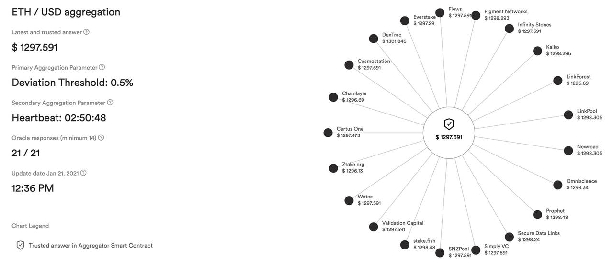
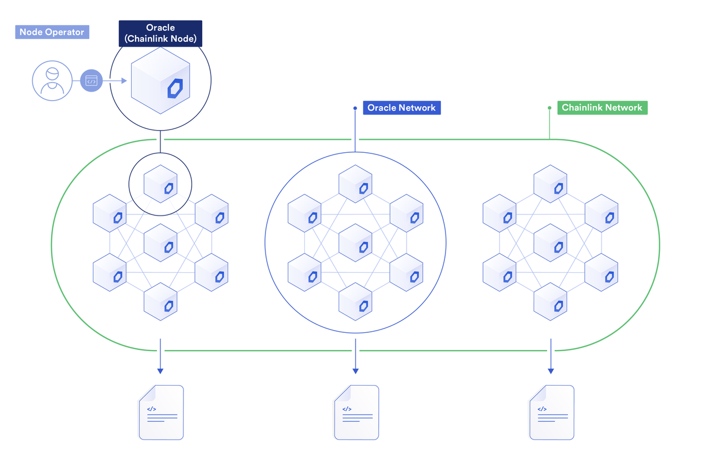
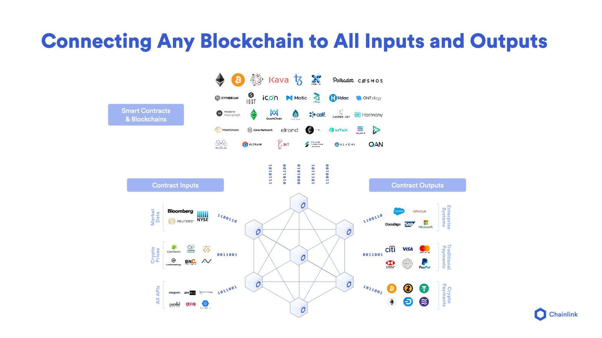
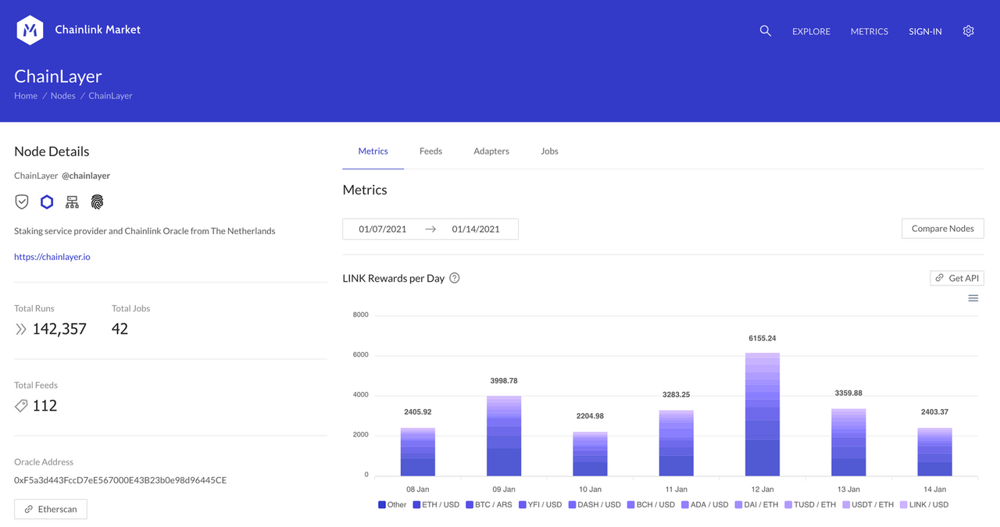
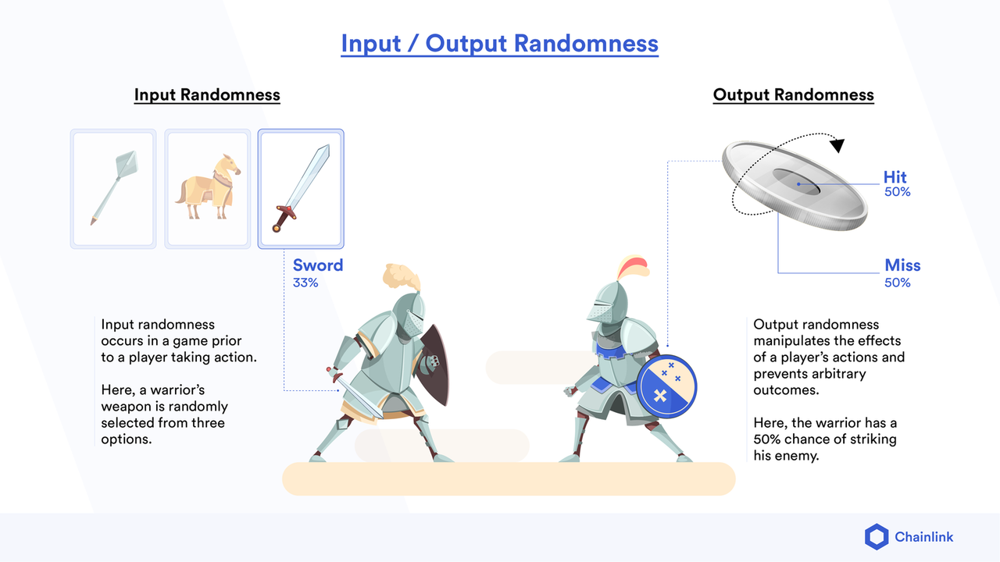

# Chainlink

* Chainlink：去中心化预言机网络 
  * 是什么：一个去中心化预言机网络 
  * 作用：旨在将区块链智能合约安全可靠地连接至链下系统 
    * 将智能合约安全地连接至区块链网络以外的数据和服务 
  * 目的=效果：现代经济中的传统系统一旦接入了Chainlink预言机，就可以连通最前沿的区块链技术，让商业和社会流程变得更加安全、透明且高效 
  * 代币：LINK 
    * 属于：Chainlink 
    * 概述：LINK是基于以太坊区块链的ERC20标准化代币，用于支付Chainlink节点运营商，以便从脱链数据中检索数据，将数据格式化为区块链可读格式，脱链计算以及保证正常运行时间。Chainlink代币作为运行节点的一部分，可防止不良参与者。 
      * Chainlink简介：首个分散的Oracle网络，允许任何人安全地提供智能合同，访问关键的外部数据，脱机支付和任何其他API功能 
  * 类比 
    * 区块链：去中心化的计算机网络 
    * 智能合约：去中心化的应用 
    * Chainlink：去中心化的互联网 
      * 让智能合约可以与链下世界交互，并同时保持区块链技术在安全、透明和信任方面的核心价值 
  * 实现细节： 
    * Chainlink采用了与区块链相同的模式，建立了去中心化的独立预言机网络，网络中的预言机从多个数据源共同获取数据，将数据聚合，并将经过验证的聚合数据传输至智能合约，触发合约执行，在整个过程中规避了所有中心化风险 
      * 举例 
        * Chainlink会通过ETH/USD喂价将以太币价格传输到区块链上，Chainlink喂价采用了众多独立的预言机节点和数据源，获取并传输价格数据（见下图）。区块链应用可以通过ETH/USD价格预言机获取当前以太币价格，将以太币作为贷款抵押，或结算以太币价格预测协议。 
          * ETH/USDChainlink喂价从多个独立的预言机运营商聚合价格数据 
            * 
  * Chainlink预言机网络的特点 
    * 去中心化 
    * 多层安全机制 
      * 通用的基础架构 
        * Chainlink框架灵活性极高，可以在上面开发和运行预言机网络。用户可以亲自打造或连接至专属的预言机网络，无需依赖其他预言机网络。 
          * Chainlink网络、预言机网络、Chainlink节点以及节点运营商分布图 
            * 
      * 数据签名 
        * Chainlink预言机会使用独特的加密签名技术对发送到链上的数据进行签名，用户可以证明数据来自某一预言机节点。 
      * 优质数据 
        * Chainlink可以将智能合约连接至包括付费数据提供商在内的所有链下系统。智能合约还可以向其他系统发送指令，比如向传统支付系统发送支付指令。 
      * 兼容所有区块链 
        * Chainlink可以在任何区块链上运行，无需依赖其他外部区块链。这意味着Chainlink可以支持公链和企业级区块链等各种区块链环境。 
          * Chainlink可以为任何区块链上的智能合约输入输出数据
            * 
      * 服务水平协议 
        * Chainlink最终将允许用户自定义链上智能合约的预言机服务条款，其中预言机节点需要支付一笔保证金，只有在节点按照服务条款完成任务后（如：按时传输数据）才能拿回保证金。 
      * 声誉系统 
        * Chainlink预言机的历史性能参数都可以在链上公开查看，而且数据经过签名验证。用户可以根据平均响应时间、任务完成率和平均保证金等各种历史性能参数筛选预言机。节点运营商也可以选择性地提供额外数据，比如身份信息、地理位置和第三方认证。 
          * 节点可以在Chainlink市场列出自己的关键功能特色，用户可以结合这些特色以及链上性能参数进行筛选 
            * 
      * 其他功能 
        * Chainlink目前还在开发其他安全功能，其中包括预言机和数据隐私以及高级预言机计算等。 
  * 主要应用场景 
    * 去中心化金融（DeFi） 
      * 贷款、支付、衍生品和资产权益等各类传统金融产品都开始通过智能合约出现在区块链上。智能合约使这些金融产品变得更加安全透明，并且降低了它们的准入门槛。这些DeFi应用接入了Chainlink预言机获得资产喂价和利率，并验证资产抵押率，因而实现了各种高级功能，比如以公允市场价值发放贷款、自动发放股息或交割期权合约。 
    * 保险 
      * 智能合约还可以用来在区块链上创建参数保险合约。Chainlink目前正在为Arbol的农作物保险产品提供天气数据，全世界各地的农民只要登陆互联网就可以获得这款农作物参数保险。这款产品根据降雨量和气温等参数，基于合约预先设置的逻辑（如：如果今年雨水量超过x，则支付y赔偿金。）及时且公平地进行理赔。 
    * 游戏 
      * 现在开发者还开始在区块链上发布智能合约游戏应用。对于许多区块链游戏来说，其中一个关键要素就是随机数生成，比如随机创建游戏场景或抽出中奖玩家。Chainlink推出了一个随机数解决方案，名为Chainlink可验证随机函数（VRF）。Chainlink VRF可以生成随机数，并将随机数传输至智能合约。用户可以证明随机数是公平公正的，因为无论是游戏玩家、游戏开发者还是第三方都无法篡改或操纵生成的随机数。 
        * Chainlink VRF为区块链游戏场景输入和输出随机数 
          * 
    * 传统系统 
      * Chainlink的另一个关键应用场景就是为数据提供商、物联网、网站和企业等传统系统提供一条路径，向所有区块链网络出售其数据和服务。由于Chainlink网络可兼容任何区块链，因此可以作为一道门户，将所有链下数据基础架构接入区块链网络。近期，世界经济论坛与Chainlink联合创始人Sergey Nazarov共同发布了一份名为《弥合治理差距：区块链和传统系统之间的互操作性》的报告，其中详细阐述了行业标准的互操作框架如何接入Chainlink这类预言机网络连通传统系统和区块链环境。 
