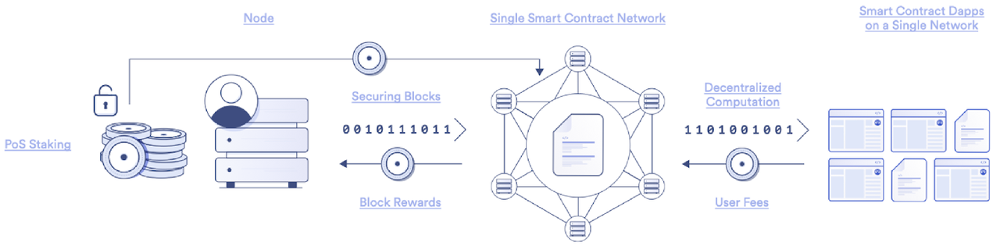

# 什么是质押

* 质押=Staking = 权益质押 
  * 其实有2种（领域内的）含义 
    * 权益证明PoS中的：质押 
      * 概述 
        * 替代之前的工作量证明PoW一种想要成为区块链出块的方式，目的是：出块后，获取奖励（代币（比如比特币）=钱） 
          * 对比 
            * PoW机制中的miner比拼的是算力 
              * PoW区块链在每一轮中，所有miner都有机会创建区块 
            * PoS机制中的验证节点比拼的是资金量 
              * PoS区块链通常会基于质押加权的随机数轮流指派验证节点创建区块 
      * 详解 
        * 权益证明（PoS）是区块链上的一种抗女巫攻击机制，验证节点必须要在网络中质押通证，才能有机会向链上添加新区块。在PoS区块链上，任何人只要质押了一定数额的原生通证，就可以加入网络成为验证节点（staker），并产出区块。验证节点质押的通证数量或者一名用户运行的验证节点数量通常决定了它被选为出块节点的概率。也就是说，质押的通证数量越多，或者控制的验证节点数量越多，那么就越有可能被选中成为出块节点。 
        * 当验证节点成功创建有效区块时，通常会从协议收到质押奖励以及部分用户交易费。PoS区块链为了减少恶意行为，往往会采取处罚机制。在这个机制下，验证节点如果违反了协议规则，将会被没收部分或全部质押的通证。一些PoS区块链中如果节点下线或出块节点未能正常出块，也会被没收质押的通证。 
        * PoS区块链利用显性质押机制，验证节点质押一定数量的通证作为保证金，如果节点违反协议规则，则保证金会被没收 
          * 
    * DeFi中的：质押 
      * 注：DeFi=去中心化金融=DeFi协议 
      * 概述 
        * DeFi中的权益质押不是为了保障区块链出块的安全，而是为了达成某一具体的目标而将通证锁定在DeFi协议中 
      * 名称来源说明 
        * 虽然“权益质押”这个词在这种情况下偏离了其原本的意思，但是由于行业内都用这个词，因此也就成了约定俗成的说法。 
      * 详解 
        * 关于：达成某一具体的目标 == 在DeFi中进行权益质押的部分案例 
          * 为协议提供保险 
            * Aave等去中心化的借贷协议采用权益质押机制来刺激流动性，AAVE通证持有者可以将手中的通证质押在协议的安全模块中，在黑天鹅事件发生时为存款人提供额外的安全保障和保险。质押通证的用户可以从协议中分得奖励 
              * https://aave.com/
          * 治理 
            * 去中心化交易平台（DEX）Curve采用权益质押机制来协调流动性提供方和治理参与者的长期经济激励。CRV通证持有者可以将手中的CRV进行“投票锁定”，并获得投票委托CRV（即：veCRV），用户锁定的时间越长，就会获得越多的veCRV。通证持有者可以通过投票锁定的方式来对协议提案进行投票，决定某个流动性池中的CRV收益率，并分得协议的部分交易费收入。 
              * https://curve.fi/
* 质押=Staking 
  * 类比：将钱存入银行储蓄账户的加密货币（=cryptocurrency=数字货币） 
  * 具体操作： 
  * 目的：获取奖励==利息收益=回报 
