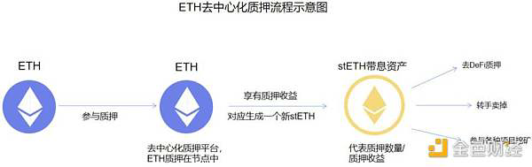
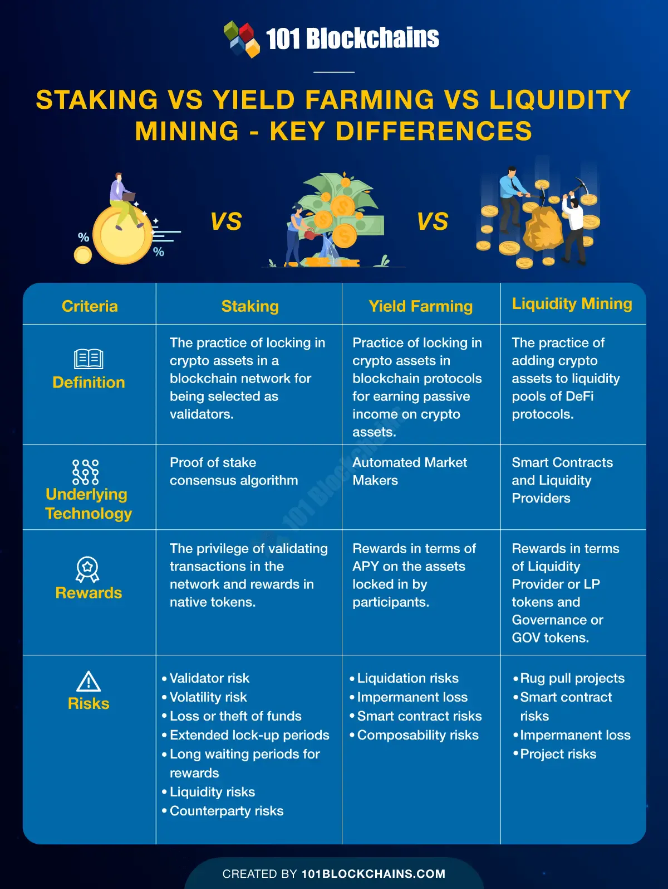

# DeFi中的流动性质押

* 对于DeFi中：存入代币，赚钱，被叫做 
  * 质押流程图 
    * 
  * Staking=质押 == 流动性质押 == 流动性挖矿 
    * = Yield = （赚取）收益 
    * = Farming=耕作=Yield Farming=收益耕作=流动性挖矿 
  * 对比 
    * Staking vs Yield Farming vs Liquidity Mining
      * 
