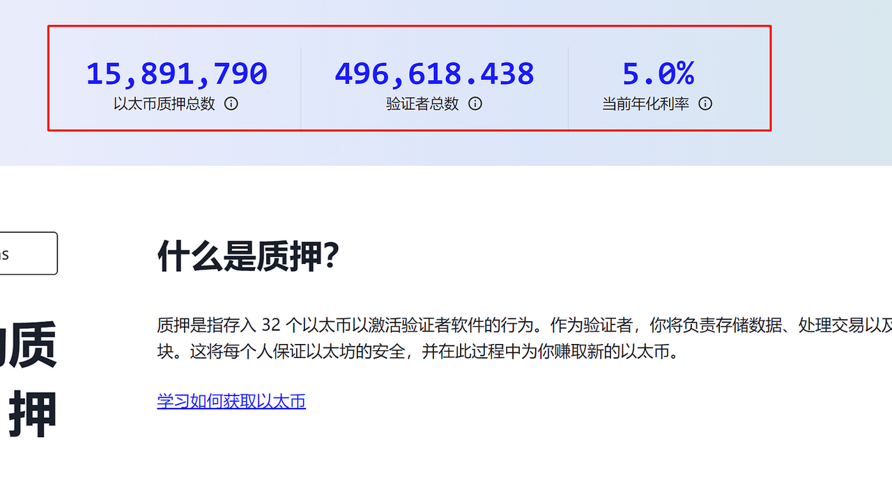
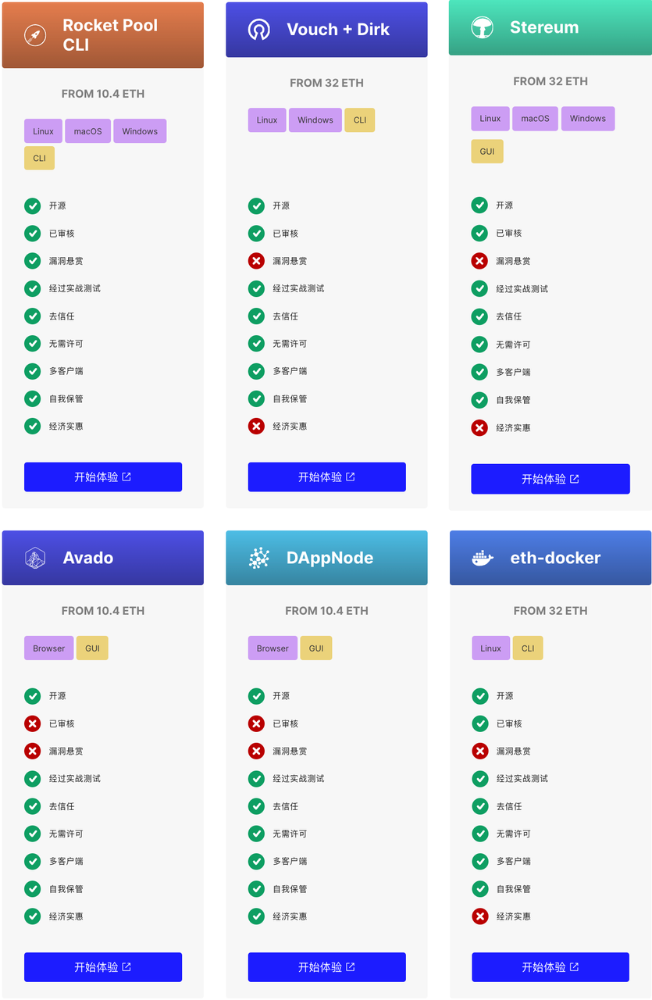
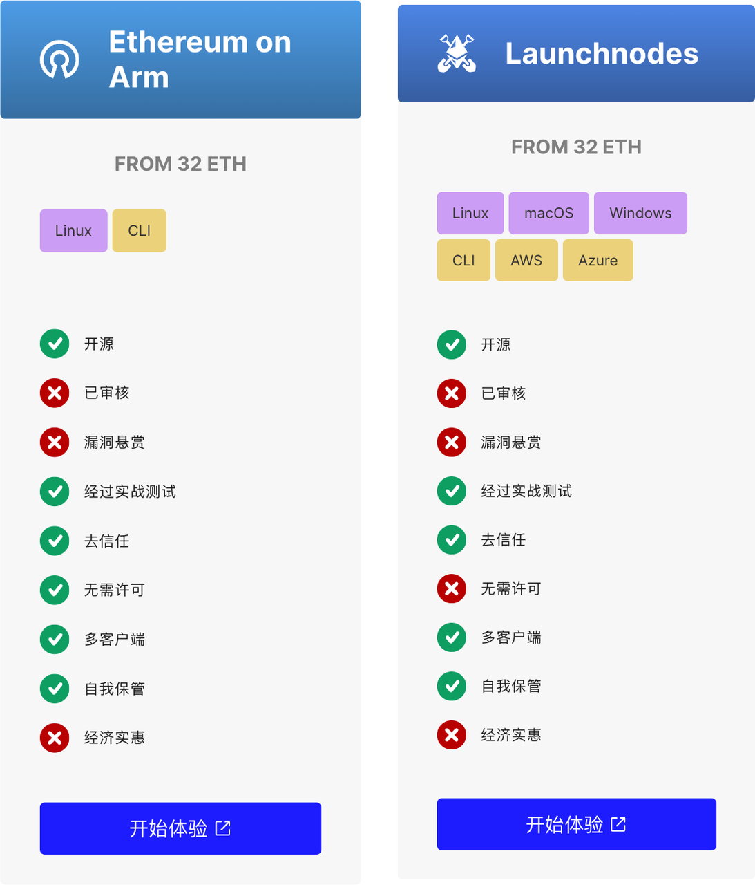
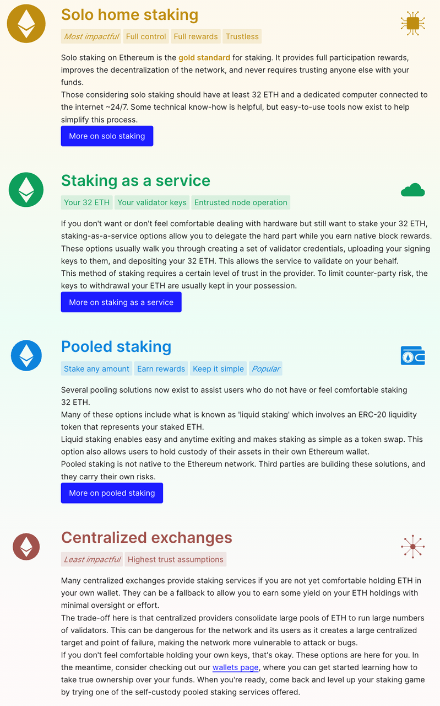
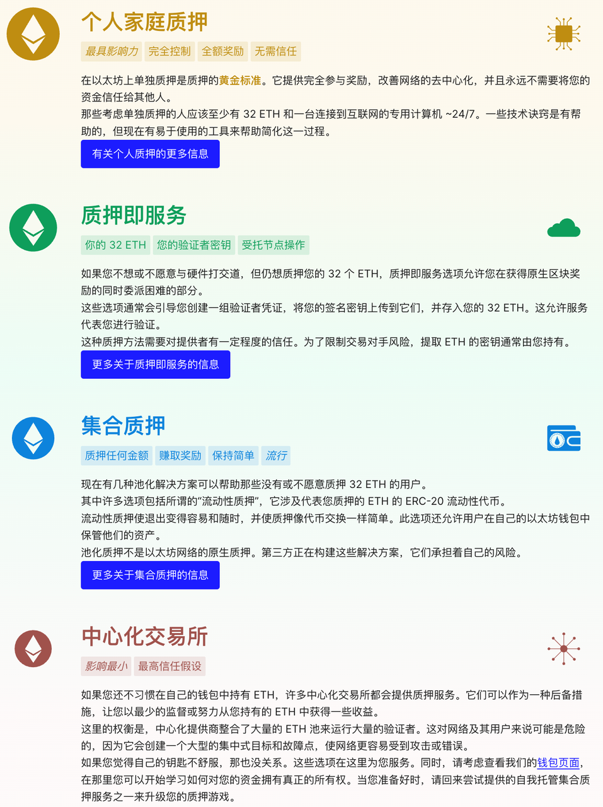
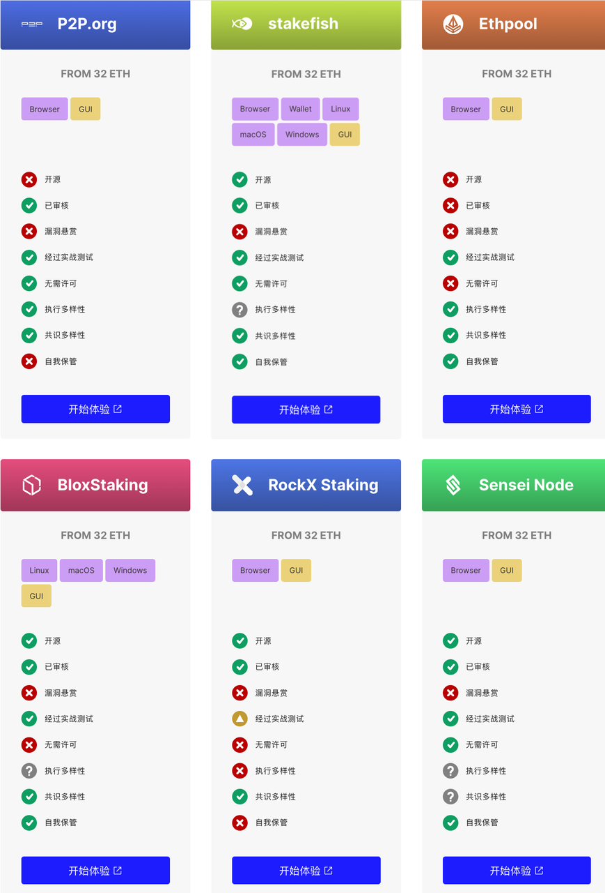
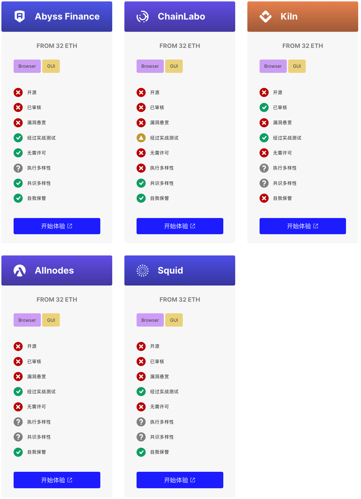
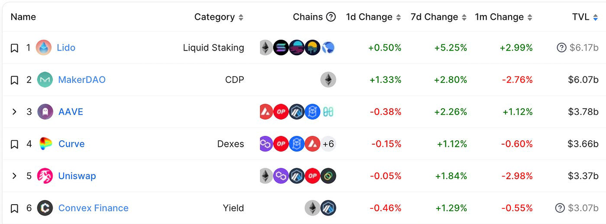
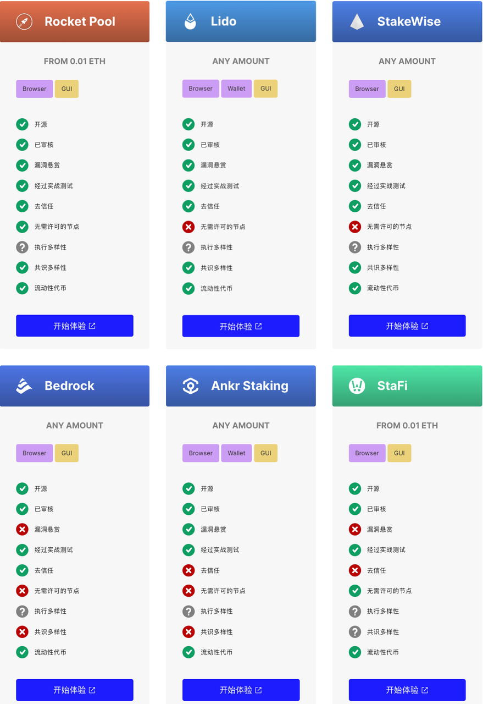

# 以太坊的PoS质押

* 以太坊的质押 
  * 概述 
    * 什么是质押：用户通过将一定数量的加密资产存入智能合约（在区块链网络上运行的公共计算机程序）中来“锁定”一定数量的加密资产 
      * 最常见的是，随着时间的推移，用户会期望获得某种特权或奖励以换取他们的股份，并且可以在他们愿意的时候提取他们的代币。 
    * 类比 
      * 质押指锁定一定数量的代币，以支持网络的运行和安全，并获得回报 
        * 类似公司的股份制度。你不仅仅要出钱占股，还要出力保障公司的运行。假如你偷懒或者损害公司利益，你的股份价值也会受损，甚至直接给你全罚没了 
          * 当然你也可以只占股，让别人代出力，但是收益也多分一些给别人 
    * 关于质押的名词解释 
      * 更准确应该用：锁定  或 存款 
        * 这种锁定代币以换取访问权限、特权或奖励的模式在整个生态系统中以多种方式发生，将它们全部称为“质押”令人困惑。通常，当您看到“质押代币”的提法时，只说“锁定”或“存款”可能更准确。 
    * 目前，通过以太坊官网我们可以查询到以下几个关键数据 
      * 图 
        * 
      * 文字 
        * （1）已经质押1589万ETH 
        * （2）拥有4.9万验证者，每个验证者质押32个ETH 
        * （3）质押的APR是5.0% 
    * 关于以太坊2.0质押的问题，就是说如果想参与到POS网络成为验证节点，需要质押32个ETH，但是质押的资金在上海升级之前无法取出，不过你可以获得5%的收益 
  * 评价 
    * 质押是保护和维护区块链网络的基本机制 
    * 像以太坊这种采用权益证明 (PoS) 的网络，安全性和可持续性要高于采用工作量证明 (PoW) 的网络 
    * 质押是一种去中心化的公共物品，有助于保护网络安全，并让用户获得奖励 
  * 以太坊的质押模式 
    * 官网资料 
      * Ethereum staking | ethereum.org
        * https://ethereum.org/en/staking/
          * Earn rewards while securing Ethereum 
            * Staking is a public good for the Ethereum ecosystem. Any user with any amount of ETH can help secure the network and earn rewards in the process 
    * 概述 
      * 原生质押模式 == 单独质押 
        * 单独质押你的以太币 | ethereum.org
      * stSaaS质押即服务 
        * 质押即服务 | ethereum.org
      * 联合质押 = 流动性质押 = Liquid Staking 
        * 允许用户质押加密资产，同时保持其资金流动性 
          * 联合质押 | ethereum.org
      * 中心化交易（CEX）所质押 
    * 详解 
      * 以太坊1.0 
        * 原生质押模式 == 单独质押 = 单人质押=Solo Staking 
          * 它对于用户资金、收益、操作和学习的门槛都很多。如果你想成为原生的质押节点，那么除了准入和锁仓门槛（至少32个ETH） 
          * 还可能会面临如下问题： 
            * 1）要自己运行一个节点，需要一台至少4G内存和2T固态硬盘的设备，并安装DAppNode。 
            * （2）要保证该节点的可靠性，奖励和节点在线和正确证明的时间成正比，如果我的节点停机了或者网速太慢会受到惩罚。 
            * （3）其他诸如硬件维护、保存密钥等杂七杂八的各种问题 
          * 节点工具=工具提供商 
            * 
            * 
      * 以太坊2.0 
        * 概述 
          * 文字 
            * stSaaS质押即服务 
            * 联合质押 
            * 联合质押 
            * 中心化交易（CEX）所质押 
          * 图
            * 
            * 
        * 详解 
          * stSaaS质押即服务 
            * stSaaS就是将钱和事给拆开，用户就是有钱（ETH）想质押，但是不想搞硬件运行节点等那些麻烦的事，于是用户通过第三方运营商存入32个ETH进行质押，用户只需要完成初始设置、交钱、生成密钥，然后将密钥发给运营商，每个月给运营商缴纳一定服务费即可。 
            * 相关服务商 
              * 
              *               
            * 但这里面的风险是，依赖第三方就可能出现对方作恶或者不靠谱的问题，比如我的节点运营商出现了停机甚至rug，那么就会导致我作为节点的验证者被处罚。 
            * stSaaS的模式解决了成为验证节点的硬件门槛，但对于大部分散户而言，考虑到目前ETH的价格，32个ETH的资金门槛还是比较高的。于是，又诞生了一种新的质押模式，即联合质押。 
          * 联合质押=流动池质押 
            * 注 
              * 流动池质押 = Liquidity Pool Staking 
                * 得到的代币，有时候称为：LP代币 
            * 联合质押则是相当于大家一起拼团凑钱（N个人凑够32个ETH），赚到的利润也一起分的过程，这样就又进一步的降低了资金的准入门槛。但联合质押的模式并没有受到以太坊的原生支持，所有的联合质押全部是第三方平台，所以它相当于是扮演了中介的角色。 
            * 联合质押还有另外一个“优点”，这也是为什么很多人会选择联合质押的原因，那就是一些联合质押的第三方平台会同时提供具有流动性的token。这个怎么理解呢？ 
            * 通过上面的内容，我们已经知道，一旦参与以太坊2.0的质押后，用户质押进去的ETH是无法提取的，直到上海升级完成后才可以提取。所以，一些联合质押平台就会提供自己平台的token作为用户质押的ETH和收益的衍生品，且该token本身具备流动性，用户可以拿着对应的token去交易借贷等操作。目前最知名也是参与人数最多的平台就是大家都知道的Lido了。 
            * 如果你参与了Lido的质押，那么Lido会给予质押者1:1数量的sttoken。比如我质押了5个ETH，那么就会得到5个对应的stETH，我还能再将stETH质押到aave平台去获取二次收益。所以，如果我们把常规的质押理解为是定期存款的话，那么类似Lido这样的联合质押就相当于是活期存款了，相当于立刻释放出了我质押金（ETH）的流动性，稳赚不赔是不是很爽。 
            * 目前，LDO（Lido的平台币）的走势比较强劲，截止到今日（23年1月10日）的最近1个月周期内，LDO的价格短短涨幅已经超过80%，Lido 的 TVL 也超跃MakerDAO再次位列第一（图6）。 
              * 
            * 相关服务商 
              * 
          * 中心化交易（CEX）所质押 
            * 交易所质押模式上与联合质押差不多，主要区别在于联合质押属于defi领域，且会运行在智能合约上面、并给予流动性token。 
            * 目前在交易所质押资金这块儿，大头基本被Binance、Coinbase、Kraken垄断。 
            * 比如Coinbase，这家美国的交易所于去年6月推出了cbETH，用于基础 ETH 以及质押产生的奖励，推出后6个月的时间就积累了 100 万个ETH。 
