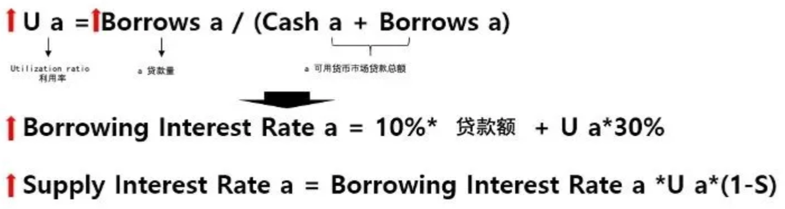
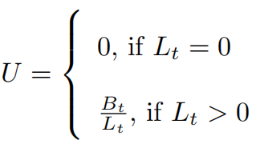

# 利用率Utilization Ratio

* DeFi中借贷协议（Compound、AAVE）中： 
  * Utilization Ratio = 利用率 
    * 名词 
      * Utilization Ratio = 利用率 = Utilization Rate 
        * = Money Utilization Ratio = 资金利用率 
      * = 借贷率=Borrowing Rate 
      * = 需求率 = Demand Ratio
    * 含义：借出的钱占借贷池里总额的比例 
      * 表示存款资金的使用情况 
        * Representing the utilization of the deposited funds 
    * 举例 
      * 最初借贷池子里有1000 USDC作为启动资金, 对应着 Cash = 1000, Borrows = 0 => Utilization = 0%；在之后的另外一个时刻，借出了500 USDC，池子里还剩500 USDC，对应着Cash = 500, Borrows = 500 => Utilization = 50% 
    * 公式 
      * Compound 
        * Utilization Ratio = Borrows / (Cash + Borrows) 
          * 
          * -》 借贷率越高，也就是需求越高 
      * AAVE 
        * 
        * 其中： 
          * L(t) =  Total Liquidity = 总流动性 
          * B(t = )Total Borrows = B(s) + B(v) = Total Stable Borrows + Total Variable Borrows=总的稳定利率借款 + 总的可变利率借款 
    * 相关 
      * AAVE 
        * 最佳利用率=Target Utilization Rate = U(optimal)：该模型所针对的利用率，超出可变利率后急剧上升 
          * The utilization rate targeted by the model, beyond the variable interest rate rises sharply  
