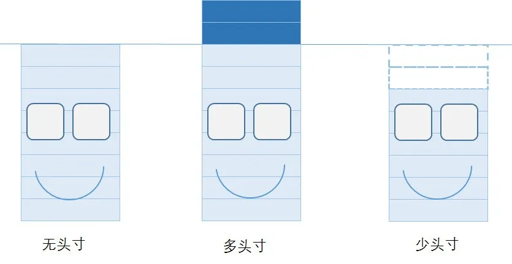

# 头寸position

* Position=头寸
  * 名词
    * Position=仓位=持仓
    * = 头寸 = 头衬
  * 是什么
    * 概述
      * 钱（的多少 == 水平）
    * 详解
      * 最初的含义：民国时十个袁大头钱币总高度是一寸，简称头寸
      * 后来：泛指钱、货币、款项
        * 款项
          * [money market]∶中国旧时指银行钱庄等所拥有的款项
          * == 买卖金融商品的契约
            * 在金融交易中，部位（持仓、头寸）是以指定价格买入或卖出指定数量金融工具（如证券、货币或商品）的具有法律约束力的承诺
          * 个人或法人持有的和/或拥有的现金、证券、商品等金融工具的总金额
        * 银根
          * [cash]∶指市场上货币流通数量
  * 含义
    * 两方面
      * （1）库存状况
      * （2）与库存状况相应的资金配置
    * -》
      * 增加一个头寸
        * 既意味着库存的一份变化
        * 又意味着一份资金的投入
    * 描述内容
      * 既可以用来描述商品
      * 也可以用来描述股(“库存”的是股票,对股价敏感)
      * 还可以描述资金(“库存”的是资金对利率敏感,这正是我国传统的意义)
    * -》这个词也可以意译成“仓"或者音译成“盘”
  * 所属领域
    * 期货和期权之买卖交易的专有名词
      * 只是在期货交易中有这种做法，在现货交易中还没有这种做法
    * 金融界及商业界的流行用语
    * 在金融、证券、股票、期货交易中经常用到
  * 解释
    * 期货合约称为“仓位”，为目前仍留置于市场中未冲销的期货契约
    * 仓位的计算单位称为“口”，每一口所表示的契约价值，则视该期货合约内容而定
  * 相关名词
    * 概述
      * 
    * 建立头寸 == 开盘 == 敞口
      * 买进一种货币，同时卖出另一种货币的行为
        * 开盘之后，长了(多头)一种货币，短了(空头)另一种货币
    * long position=多头=多头寸=多头头寸
      * 看涨市场趋势，买进期货，则为持有“多头部位”
      * 在期货交易中建仓时,买入期货合约后所持有的头寸
      * 银行在当日的全部收付款中，收入大于支出款项
      * 相关操作
        * 投资者买入并非早前沽出的期权合约，代表他建立（open）多头
        * 投资者卖出早前买入的期权合约，代表他平了（close）多头
    * short position=空头=缺头寸=空头头寸
      * 看跌市场趋势，卖出期货，则为持有“空头部位”
      * 银行在当日的全部收付款中，付出款项大于收入款项
      * 卖出期货合约后所持有的头寸
      * 相关操作
        * 投资者卖出并非早前买入的期权合约，代表他建立了空头
        * 投资者买入早前卖出的期权合约，代表他平了空头
    * bull position
      * 持有好仓的投资者预期标的物的价格会上升
      * 投资者会多头认购权证（long call）或空头认沽权证（short put）
    * bear position
      * 持有淡仓的投资者预期标的物的价格会下跌
      * 投资者会多头认沽权证（long put）或空头认购权证（short call）
    * 中性策略 =neutral strategy
      * 投资者预期标的物的价格会横行，可以采用中性策略
      * 投资者会空头认购权证（short call）及空头认沽权证（short put）
    * 头寸松=头寸多
      * 收多付少
      * 暂时未用的款项大于需用量
    * 头寸紧=头寸缺
      * 收少付多
      * 资金需求量大于闲置量
    * 净头寸
      * 商品未平仓多头合约与未平仓空头合约之间的差额
      * 开盘后获取的一种货币与另一种货币之间的交易差额
    * 头寸日
      * 种类
        * 第一头寸日(期货交割过程的第一日)
          * 多数就是指对款项动用的当日
    * 金融同业领域
      * 轧(ga)头寸=轧平头寸
        * 结算收付差额
        * 预计这一类头寸的多与少的行为
      * 调头寸 == 拆头寸 = 头寸拆借
        * 借款弥补差额
        * 到处想方设法调进款项的行为
    * open Interest = 持仓兴趣
  * 效果、逻辑
    * 选择适当的汇率水平以及时机建立头寸是盈利的前提
      * 如果入市时机较好，获利的机会就大
      * 相反，如果入市的时机不当，就容易发生亏损
